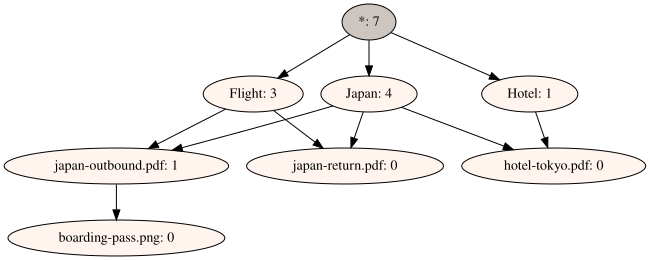

# OntoDAG User Guide

OntoDAG helps you organize things — files, notes, photos, products, ideas — into
**categories that can overlap**. You put items in, telling OntoDAG which categories
each one belongs to, and later you ask questions like *"show me everything that is
both a Flight document and part of the Japan trip."*

This guide is for everyday users. It assumes you can open a terminal and copy-paste
commands, but not much more. Every example in it has been run for real — the outputs
you see are genuine. It is a *tutorial*: it teaches by doing. When you already know
what you're doing and just need to look something up — a flag, a setting, an
endpoint, a grammar rule — use the compact [`REFERENCE.md`](REFERENCE.md) instead.
If you want to know how OntoDAG works internally, read
[`HOW_IT_WORKS.md`](HOW_IT_WORKS.md) afterwards.

---

## Quick start (two minutes)

Install, and you have the `odag` command (no file to create — a default
store appears in `~/.ontodag`):

```console
$ pip install ontodag
```

File things under **as many categories as apply** — no folder to choose.
Run `odag prelude` once and dates, weights and sizes work as typed values:

```console
$ odag put Travel
$ odag put Japan Travel
$ odag put Flight Travel
$ odag prelude
$ odag put boarding-pass.pdf Flight Japan 'time(2026-08-15)'
$ odag put hotel-kyoto.pdf Japan
```

Then ask. Every question is "everything under *all* of these":

```console
$ odag get Japan
boarding-pass.pdf
hotel-kyoto.pdf
$ odag get Travel 'time(2026)'
boarding-pass.pdf
$ odag below boarding-pass.pdf Travel
true
```

The boarding pass came back for `time(2026)` although you filed it under a
single *day* — the containment is computed, no link was stored. That's the
whole system: `put` with categories, `get` with categories, `below` to
check one fact. Everything else in this guide — Python, typed values in
depth, the web app, publishing to Swarm, AI agents — builds on exactly
this.

The same in Python, if that's your home ground:

```pycon
>>> from ontodag import OntoDAG
>>> dag = OntoDAG()
>>> dag.put("Travel", [])
>>> dag.put("Japan", ["Travel"])
>>> dag.put("hotel-kyoto.pdf", ["Japan"])
>>> sorted(item.name for item in dag.get(["Travel"]))
['Japan', 'hotel-kyoto.pdf']
```

---

## 1. Why OntoDAG? (one minute)

Computers usually offer two ways to organize things, and both are frustrating:

- **Folders** force every item into exactly one place. Where does your flight
  confirmation for the Japan trip go — `Flights/` or `Japan/`? You must choose, and
  whichever you choose, you'll look in the other one first.
- **Tags** let an item carry many labels, but the labels themselves are a flat,
  unstructured heap. Tagging a scan `boarding-pass` doesn't make it show up when you
  search for `flight`, unless you remembered to add `flight` too. And `Japan`. Every
  time.

OntoDAG sits exactly between the two:

- Like tags, an item can belong to **many categories at once**.
- Like folders, categories are **organized**: a boarding pass can live under the
  flight it belongs to, which lives under `Flight` and `Japan` — so the boarding pass
  automatically counts as part of the trip, without you repeating yourself.

There is one more idea, and it's the whole query language: **asking = intersecting.**
You ask with a set of categories, and you get back everything that is under *all* of
them. `Flight` + `Japan` → the flights for that trip, but not the hotel booking (also
Japan, but not a flight) and not last year's flight to Berlin (a flight, but not this
trip).

A note on vocabulary: in OntoDAG there is no difference between an "item" and a
"category." Everything is just a named thing that can sit under other named things
and can have things under it. Today's item is tomorrow's category — file a flight
confirmation, and later file the boarding pass under *it*. This is deliberate, and
it is how the trip's paperwork ends up organizing itself.

### 1.1 Ways in and out

The same DAG is reachable five ways. They are surfaces over one store, not
separate products — point them at the same store and they see the same thing.

| Surface | What it is | Where |
| --- | --- | --- |
| **Python** | `from ontodag import OntoDAG` — the library everything else wraps | §3, §4 |
| **Command line** | `odag`, a Unix tool: silent on success, pipes cleanly | §5 |
| **Web** | a browser UI: browse by query, a console, clickable pictures — plus a REST API for `curl` | §6 |
| **Agents** | `odag-mcp`, the store as MCP tools, with verifiable answers | §9 |
| **Filesystem** | [ontodag-fs](https://github.com/petfold/ontodag-fs): paths as queries, FUSE-mountable | separate repo |

Not everything is available everywhere. The gaps are deliberate rather than
accidental — each surface exposes what makes sense for who is using it:

| | Python | CLI | Web | MCP |
| --- | --- | --- | --- | --- |
| put / remove (contraction) | ✓ | ✓ | ✓ | ✓ (with `--write`) |
| query, union (`or`), `below` | ✓ | ✓ | ✓ | ✓ |
| typed values (`weight(3kg)`) | ✓ | ✓ | ✓ | ✓ |
| **move** (reclassify) | ✓ `reclassify` | ✓ `move` | ✓ `PATCH /dag/node` | — |
| **delete a cone** (item + contents) | ✓ `remove_cone` | ✓ `remove --cone` | ✓ `DELETE …?cone=1` | — |
| **excerpt** (query-scoped export) | ✓ `excerpt` | ✓ `excerpt` | ✓ `/dag/query/export*` | — |
| **diff two stores** | ✓ `ontodag.compare` | ✓ `diff` | — | — |
| **overlapping** (might-satisfy, G6) | ✓ `get_overlapping` | ✓ `overlapping` | ✓ `/dag/overlapping` | ✓ |
| **canon** (what a spelling stores) | ✓ `ontodag.surface` | ✓ `canon` | ✓ `/dag/canon` | ✓ |
| **declare dimensions** (prelude / packs) | ✓ | ✓ | ✓ `/dag/prelude`, `/dag/pack` | — |
| **version history** (`history`/`undo`/`redo`) | ✓ via the store | ✓ | n/a | — |
| **as-of** (read a past version) | ✓ `RecordStore.at` | ✓ `--as-of` | n/a | ✓ |
| readable rendering | ✓ (`ontodag.surface`) | ✓ | ✓ | ✓ (beside the exact name) |
| import / export / merge | ✓ | ✓ | ✓ | — |
| **merge preview** (what would arrive, compatibility) | ✓ `ontodag.compare` | ✓ `merge --diff`, `pack --diff` | — | — |
| **overlay views** (read-only layers joined into answers) | ✓ merge into a view | ✓ `overlays` setting | — | — |
| **ingest a projection stream** | ✓ (`put` per line) | ✓ `ingest` | — | — |
| pictures | ✓ | ✓ | ✓ | — |
| Swarm stores | ✓ | ✓ | — | ✓ |
| **encrypted stores** (`store_key`) | ✓ `ontodag.encstore` | ✓ | — | ✓ (same settings; no certificates over ciphertext) |
| certificates, provenance, review | ✓ | — | — | ✓ |

The empty cells are decisions, not oversights, and each has a reason:

- **MCP has no move or cone delete** — on the agent surface a retraction owes a
  signed retraction record per claim it withdraws (§9.1). That is a provenance
  decision, not a transcription of the CLI.
- **MCP has no excerpt, diff, export or pictures** — an agent gets answers with a
  root and a canonical echo, not files.
- **The web app has no version history, as-of, certificates or store tiers** —
  its DAG is *server memory per session* (§6). There is no store and no root
  there, so those aren't withheld; they don't exist. Its console runs 13 of
  the CLI's 27 commands for the same kind of reason: the rest read or write
  filesystem paths on the server, or need a store that keeps versions. The
  `Commands` button lists all 27 anyway, saying which is which.
- **The web app has no overlay views** — the `overlays` setting is read from
  the *server's* environment, and composing the operator's layers into an
  anonymous visitor's sandbox would serve strangers another user's data.
- **MCP has no overlay views yet** — every MCP answer cites the root it was
  computed from, and a composed view has no root to cite; what an agent
  should be told about a joined answer is a design question, not a missing
  flag.
- **diff has no web surface** — the second store has to come from somewhere, and
  an upload is a design question rather than a missing endpoint.
- **The CLI has no provenance, review or certificates** — signing needs a key
  with an *identity*, and whose (and on what authority) is unsettled for a human
  command line; the agent surface answers it with a store-configured signer.

The web app's own workload log (`GET /dag/stats/queries`) has the opposite
shape: it exists only there, which is a known limitation rather than a design —
the counters that ought to drive index decisions are collected on the surface
least used for real work.

The two surfaces with the most on them are Python (which has everything, being
the thing the others call) and MCP (which is deliberately the *verifiable*
surface — see §9). The CLI is the one to reach for interactively; the web app
is the one to show someone.

---

## 2. Installation

You need **Python 3.11 or newer**.

```bash
pip install ontodag
```

This installs the `odag` command, the Python library and one small
dependency (`recordstore`, 184 KB of pure Python with no dependencies of its
own). No compiler step, no system package to find, under a megabyte on disk.

That one dependency is deliberate: it is what gives you **canonical roots,
snapshots and verifiable answers** out of the box rather than behind a flag
(§5.1, §8). Everything heavier — pictures, OWL, Swarm, the web app — is an
extra you ask for.

### Which platforms

The core is pure Python with no compiled extensions, and paths are resolved
portably — `~` means your home directory on every platform, including
`C:\Users\you` on Windows. What differs is how much has actually been *run*:

| Platform | Status |
| --- | --- |
| Linux | Tested — the full suite runs here on every change. |
| macOS | Tested (2026-08-04, `[all,test]` install, full core suite green on Python 3.13). Install Graphviz with `brew install graphviz`, and see "Which Python" below. |
| Windows | Tested (2026-08-24, Windows 11, Python 3.13, `ontodag[test]` install): the core, the CLI, file stores and `rs:` record stores all work. See "On Windows" below for the three things that behave differently. The Swarm *signer* still needs the `bee` package, which builds a native secp256k1 extension — the least likely piece to install cleanly, and untested there. |

Nothing in the store itself is platform-specific: it is a canonical text file
(§5.1), so the same store works on any of the three, and `$ONTODAG_HOME`
overrides its location if you want it somewhere other than your home directory.
If you hit a platform problem, please report it — that is how the table above
gets shorter.

### On Windows

Three things differ, and none of them is a bug in the store.

**Pictures need a Graphviz *program*, not just the package.** `pip install
"ontodag[viz]"` installs the Python wrapper; the `dot` executable it drives is
a separate download on every platform, and on Windows it is not on `PATH`
afterwards unless you put it there:

```powershell
winget install graphviz        # or the installer from graphviz.org
# then, in a NEW shell (PATH is read at startup):
dot -V
```

If `dot -V` still says the command is not recognised, add Graphviz's `bin`
directory to `PATH` yourself — the installer offers to do it and the offer is
easy to miss.

Until `dot -V` answers, `odag visualize`, the image endpoints and the DOT/LaTeX
exports will tell you the binary is missing. Everything else works without it.

**Redirection with `>` mangles accented text — use `-o` instead.** `odag`
writes UTF-8 to a pipe or a file whatever your codepage says, but PowerShell
re-decodes a child program's output using the console codepage before writing
the file, so `odag get dokumentum > out.txt` turns `árvíztűrő tükörfúrógép`
into `árvízt...`. Every command that produces text takes `-o FILE`, which
writes the file itself and is therefore immune:

```powershell
odag get dokumentum -o kimenet.txt
Get-Content kimenet.txt -Encoding UTF8
```

If you want `>` to work anyway, tell PowerShell what encoding the child is
using first — `[Console]::OutputEncoding = [System.Text.Encoding]::UTF8` —
and remember that Windows PowerShell 5.1 then writes the file as UTF-16.

**The config file's permissions are not enforced by a mode.** On Linux and
macOS `~/.ontodag/config` is written `0600`, because it can hold `bee_signer`,
a private key. Windows has no POSIX permission bits — `chmod` there toggles
the read-only attribute and nothing else — so what keeps that file private is
the ACL on your user profile, which excludes other non-administrator users by
default. That is weaker than the guarantee on the other two platforms: an
administrator account, or a profile directory whose inherited permissions have
been widened, can read it. If the key matters, keep it in the `BEE_SIGNER`
environment variable instead of the config file.

One packaging trap seen in testing, unrelated to OntoDAG: if pip reports
`Permission denied` on a path under `AppData\Local\pip\cache`, its wheel
cache has picked up bad permissions — `pip install --no-cache-dir ...` gets you
past it.

### Which Python

**3.11 or newer** for OntoDAG itself, and that is the whole story for the base
install — it is pure Python, so it installs on anything from 3.11 to the
newest release the day that release lands.

The heavy extras are a different question, because they are not ours. The
Swarm signer (`ontodag[swarm]`, and therefore `[all]`) reaches `swarm-bee`,
which needs **`coincurve`** — a compiled secp256k1 binding. A brand-new Python
has no prebuilt `coincurve` wheel on PyPI for the first months of its life, so
pip falls back to building it from source, and that build currently fails.
Python **3.14** is in that window today; 3.13 has wheels for every dependency.

So: if you want the Swarm, OWL or web extras on a very new Python, create the
environment against the previous release explicitly.

```bash
python3.13 -m venv .venv          # not bare `python3`, if that is 3.14
source .venv/bin/activate
pip install "ontodag[all]"
```

One trap worth naming, because it cost a tester an hour: re-running
`python3 -m venv .venv` **over an existing venv does not rebuild it**. You can
end up with `pyvenv.cfg` claiming 3.14 while the `python3` symlink still points
at 3.13 and `pip`'s shebang is hardcoded to 3.14 — so `python3 --version` tells
you one thing and installs quietly happen under another, which is exactly the
state in which "but I *am* on 3.13" stops being true. Use `--clear` (or delete
the directory) whenever you recreate one:

```bash
python3.13 -m venv --clear .venv
```

### If that fails with `externally-managed-environment`

```
error: externally-managed-environment
× This environment is externally managed
```

You are on Debian, Ubuntu 23.04+, Fedora, or Homebrew Python, which reserve the
system Python for the OS package manager (PEP 668). Nothing is wrong with your
setup — pick the route that matches what you actually want:

- **Just the `odag` command.** [pipx](https://pipx.pypa.io) installs it into its
  own private environment and puts the command on your `PATH`:

  ```bash
  sudo apt install pipx          # once, if you don't have it
  pipx install ontodag
  ```

  Extras go in the same spec — `pipx install "ontodag[web]"` — and later
  upgrades are `pipx upgrade ontodag`. The catch: this gives you the *command*
  only. `import ontodag` in your own Python scripts will not find it.

- **The Python library as well.** Use a virtual environment:

  ```bash
  python3 -m venv ~/.venvs/ontodag
  source ~/.venvs/ontodag/bin/activate
  pip install ontodag
  ```

  Both `odag` and `import ontodag` work while that environment is active.

- **Override the guard**, if you accept that pip and apt then share a directory:

  ```bash
  pip install --user --break-system-packages ontodag
  ```

### Extras: ask for what you need

| Extra | What it adds | Install |
| --- | --- | --- |
| `viz` | pictures — `odag visualize`, `/dag/image`, DOT and LaTeX export | `pip install "ontodag[viz]"` |
| `owl` | OWL and Manchester import/export (§4.6) | `pip install "ontodag[owl]"` |
| `swarm` | keeping a store on Ethereum Swarm (§5.1, §8) | `pip install "ontodag[swarm]"` |
| `web` | the browser interface and REST API (§6) | `pip install "ontodag[web]"` |
| `all` | every extra in this table — Swarm and web included | `pip install "ontodag[all]"` |

Combine them in one spec: `pip install "ontodag[viz,owl]"`.

**Pictures need one more thing.** The `graphviz` Python package is only a
wrapper; the `dot` program that does the drawing comes from your operating
system:

```bash
sudo apt install graphviz        # Debian/Ubuntu
brew install graphviz            # macOS
```

If you skip an extra and then use the feature, the error tells you which one
to install — nothing fails obscurely. And if you can't install Graphviz at
all, `generate_dot_source()` still gives you the DOT text to render
elsewhere.

> **Why so little in the base install?** OntoDAG is meant to be usable in
> places where a 30 MB dependency tree is not: slim containers, embedded
> targets, and eventually a browser (a pure-Python package with a
> pure-Python closure is what Pyodide can install). Keeping the base
> dependency-free is a tested property, not an aspiration — see
> `tests/test_boundaries.py`.

> **Working from a source checkout instead:** `git clone
> https://github.com/petfold/ontodag.git && cd ontodag`, then either
> `pip install -e .` (subject to the same PEP 668 guard as above — inside a
> venv, or with `--user --break-system-packages`) or prefix commands with
> `PYTHONPATH=src`, e.g. `PYTHONPATH=src python3 -m ontodag show`, which needs
> no install at all. Everything below works either way; we'll write `odag` for
> short, which is the same as `PYTHONPATH=src python3 -m ontodag`.
>
> Install the checkout *once*, one way. Two editable installs of the same
> repository (say a venv and a `--user` one) both put an `odag` on your `PATH`
> and the later one silently wins — they run the same code, but `odag -V`
> reports whichever install's metadata is found, so a stale one can claim an old
> version number indefinitely.

---

## 3. A five-minute tour (Python)

Start `python3` and type along. Everything is done with plain names:

```python
>>> from ontodag import OntoDAG

>>> dag = OntoDAG()

# Top-level categories: no parents. Two kinds of document, one trip.
>>> dag.put("Flight", [])
>>> dag.put("Hotel", [])
>>> dag.put("Japan", [])

# Things under several categories at once — this is the point of OntoDAG.
>>> dag.put("japan-outbound.pdf", ["Flight", "Japan"])
>>> dag.put("japan-return.pdf", ["Flight", "Japan"])
>>> dag.put("hotel-tokyo.pdf", ["Hotel", "Japan"])

# A document filed under another document: the boarding pass for that flight.
>>> dag.put("boarding-pass.png", ["japan-outbound.pdf"])
```

Here is the resulting graph, drawn by OntoDAG's own visualizer (§4.5). Arrows
point from general to specific; `*` is the built-in root above everything; the
number after each name is how many things sit below it:



Now ask questions. A query is a list of categories; the answer is everything under
**all** of them:

```python
>>> for item in dag.get(["Flight", "Japan"]):
...     print(item.name)
japan-return.pdf
boarding-pass.png
japan-outbound.pdf

>>> for item in dag.get(["Hotel", "Japan"]):
...     print(item.name)
hotel-tokyo.pdf
```

(Results are a set, so the order can vary.) Notice `boarding-pass.png` appeared
under `Flight` + `Japan` even though you never said it was a flight document or
part of the Japan trip — it's under `japan-outbound.pdf`, and that's enough. That's
the inheritance doing your bookkeeping for you.

And asking for the trip alone gathers everything, whatever kind of document it is:

```python
>>> sorted(item.name for item in dag.get(["Japan"]))
['boarding-pass.png', 'hotel-tokyo.pdf', 'japan-outbound.pdf', 'japan-return.pdf']
```

That is the folder you never had to make.

Two more one-liners worth knowing:

```python
>>> dag.nodes["Japan"].descendant_count   # how many things are under Japan?
4
>>> dag.get(["Iceland"])                  # unknown names are simply empty
set()
```

That's the core of OntoDAG. Everything else in this guide is ways to do the same
three things — **put, get, remove** — from files, from the command line, from a
browser, or over the network.

---

## 4. Everyday operations in Python

### 4.1 Adding items: `put`

```python
dag.put("seat-reservation.pdf", ["Flight", "Japan"])
```

Rules of the road:

- **Parents must already exist.** `dag.put("X", ["Nope"])` raises
  `ValueError: One or more super-categories do not exist.` Add categories top-down.
- **No parents means top-level:** `dag.put("Lisbon", [])` files `Lisbon`
  directly under the root `*` — that's how you start the next trip.
- **Names are the identity.** Putting a name that already exists doesn't create a
  duplicate — it adds the new parent links to the existing item.
- **Redundant links are cleaned up automatically.** Say you add
  `dag.put("boarding-pass.png", ["Japan", "japan-outbound.pdf"])`. The `Japan` link
  is redundant — the boarding pass is already part of the trip *via* the flight it
  belongs to — so OntoDAG silently skips it:

  ```python
  >>> sorted(p.name for p in dag.nodes["boarding-pass.png"].parents)
  ['japan-outbound.pdf']
  ```

  You can never make the graph messy this way; it tidies itself. (Why it insists on
  this is explained in [`HOW_IT_WORKS.md`](HOW_IT_WORKS.md) — it's the property the
  whole design rests on.)
- **Cycles are refused.** Categories can't be their own ancestors:

  ```python
  >>> dag.put("Flight", ["boarding-pass.png"])
  ValueError: Edge boarding-pass.png -> Flight would create a cycle.
  ```

(For the record: everywhere this guide passes a name string, an `Item` object —
`from ontodag import Item` — is accepted too; `dag.put(Item("Flight"), ...)` and
`dag.put("Flight", ...)` mean exactly the same thing. Strings are just easier.)

**The `optimized=True` flag.** Sometimes you know some general categories for an
item, and more specific ones already exist that follow from them. With
`optimized=True`, `put` files the item under the *most specific* categories your
list implies, instead of the ones you typed. Example: suppose categories `AB`
(under A and B), `BC` (under B and C), `ABC` (under AB and BC) and `CD` (under C
and D) exist, and you add:

```python
dag.put("E", ["AB", "CD"], optimized=True)
```

E ends up under `ABC` and `CD` — because anything under both `AB` and `CD` is
under A, B, C and D, and `ABC` is a more precise home that already captures three
of those. If that sounds like more thinking than you want to do: that's exactly why
the flag does it for you. When in doubt, leave it off; the default is predictable.

### 4.2 Asking questions: `get`

```python
results = dag.get(["Flight", "Japan"])
for item in results:
    print(item.name)
```

- One or more category names; the answer is everything under **all** of them,
  returned as a set of item objects — each has a `.name` and a
  `.descendant_count`.
- The categories themselves are not in the answer (asking for `Flight` + `Japan`
  returns the flight documents, not `Japan`).
- Unknown category → empty set, no error.
- An empty list raises `TypeError` — a query has to ask *something*.
- Order doesn't matter, and redundant terms are ignored: asking for
  `[Japan, japan-outbound.pdf]` is the same as asking for
  `[japan-outbound.pdf]`, since everything under the flight is already under the
  trip. You can be sloppy; the query planner sorts it out (and picks an efficient
  evaluation order for you — details in the internals doc).

**OR-queries: `get_any`.** `get` is AND; for alternatives, give `get_any` a
list of queries and it returns everything matching *at least one* of them:

```python
dag.get_any([["Flight", "Japan"], ["Hotel"]])   # (Flight AND Japan) OR Hotel
```

Same rules per branch as `get` (an unknown category empties only its own
branch), and it composes with typed values (§4.7) — the classic use is *outside
a range*, which no single AND-query can say:

```python
dag.get_any([["time(..2026-01-01)"], ["time(2026-12-31..)"]])   # before or after
```

On the command line the literal word `or` does the same job
(`odag get Flight Japan or Hotel`), and over REST it's a pipe
(`/dag/query?cat=Flight,Japan|Hotel`).

**Yes/no questions: `is_below`.** When you don't want the list, just the
answer — *does A fit within B?* — there's a direct test:

```python
dag.is_below("boarding-pass.png", "Japan")      # True
dag.is_below("Japan", "boarding-pass.png")      # False — direction matters
dag.is_below("time(2026-08-15)",
             "time(2026-06-01..2026-08-31)")    # True, from the names alone
```

It's the Boolean face of the same fits-within relation: reflexive
(`is_below("Flight", "Flight")` is True), fail-closed on unknown names (False,
never an error), and answered by walking *upward* from A with early exit —
so it's fast even when B is a huge category, and cheap over the network on
a lazy reader. With typed values it needs no graph at all: the last line
above is pure arithmetic, a pocket containment check for dimension terms.

### 4.3 Removing: `remove`

```python
dag.remove("japan-outbound.pdf")
```

What happens to its children? They are **reconnected to its parents**, so
nothing becomes orphaned and no query answer changes except those that mentioned
the removed item itself:

```python
>>> dag.put("gate-info.txt", ["japan-outbound.pdf"])
>>> dag.remove("japan-outbound.pdf")
>>> sorted(p.name for p in dag.nodes["gate-info.txt"].parents)
['Flight', 'Japan']
```

`gate-info.txt` silently moved up to where the flight used to hang — still a
flight document, still part of the trip.

That is *contraction*, and it is the right default: it removes a category
without losing anything filed under it. To *move* an item to a different
category rather than remove it, see `reclassify` (§5.10 shows it on the command
line):

```python
>>> dag.reclassify(["ProjectA"], to=["archive"], from_=["active"])
{('active', 'ProjectA')}
```

When you mean the opposite — the category **and its contents** — use
`remove_cone`:

```python
>>> dag.cone_removal_plan(["Japan"])       # pure: ask before you act
({'Japan', 'JAL', 'JAL-cheap', 'Ryokan', 'Onsen'}, {'Japan', 'Onsen'})
>>> dag.remove_cone(["Japan"])
{'Japan', 'Onsen'}
```

The first set is the cone; the second is what actually goes. In a DAG an item
can hang in several places, so "delete the subgraph" needs a rule, and the rule
is: **something is deleted when the root can no longer reach it.** `Onsen` was
only in Japan, so it goes; `JAL` is also a Flight, so it stays exactly where it
still belongs. Survivors are *detached*, never reattached upward — reattaching
would file `JAL` under whatever was above `Japan`, which is a claim nobody made.

The walk uses asserted edges only, so deleting the cone of a typed value like
`weight(..5kg)` takes what was filed under that spelling, not every lighter
value in the store.

### 4.4 Combining two DAGs: `merge`

```python
mine.merge(theirs)      # everything in `theirs` is now also in `mine`
```

Merging unions the two graphs: all names from both, all category relationships from
both, redundant links pruned as usual. Items with the same name are treated as the
same item (names are the identity — so agree on names before you merge!).

Merge is designed so that **order never matters**: if you merge my DAG into yours
and I merge yours into mine, we end up with identical graphs. That is what lets
several people maintain one shared ontology without a central server — the
persisted form of it is `sync`, in §8.

### 4.5 Pictures

```python
from ontodag import OntoDAGVisualizer

viz = OntoDAGVisualizer(format="png")        # also: "svg", "pdf"
viz.visualize(dag, filename="travel")        # writes travel.png
```

Needs the `viz` extra *and* the Graphviz system program (§2). If you can
only have one of them, `viz.generate_dot_source(dag)` returns the DOT text
for any other Graphviz implementation to draw — including one in a browser.
The root is drawn shaded; arrows point from general to specific.

### 4.6 Saving and loading files

OntoDAG reads and writes standard **OWL ontology** files, in two flavors
(needs the `owl` extra — §2):

```python
from ontodag import OWLOntology

# Human-friendly text format (Manchester syntax) — recommended:
OWLOntology.export_dag_manchester(dag, "travel.omn")
dag2 = OWLOntology.import_dag_manchester(file_name="travel.omn")

# RDF/XML (.owl), for interoperability with other ontology tools:
OWLOntology.export_dag(dag, "travel.owl")
```

`.omn` files are ordinary text you can read and even write by hand — see §7. Both
formats open in standard ontology editors like Protégé.

### 4.7 Typed values: parametric dimensions

Everything so far has sorted itself by the edges you asserted. But dates are the
one thing you always want to ask about travel documents — *what did I book for
last summer?* — and nowhere in a graph of names does it say that 15 August falls
inside June-to-August. **Parametric dimensions** add exactly that: values written
as `time(2026-08-15)` are ordinary categories whose ordering OntoDAG *computes*
from the value, so a "last summer" query matches an August flight with no edge
ever stored between them, at any date range you care to ask.

The no-ceremony path: `odag prelude` (or `ontodag.prelude.apply(dag)` in
Python) declares the everyday dimensions — `weight`, `length`, `duration`,
`time`, `geo`, `size` — in one idempotent merge, and everything below just
works. What it does is nothing special: a dimension is declared by placing
it under one of the four built-in kind categories, which you can always do
by hand (create those like any other category):

```python
dag.put("dimension", [])
dag.put("calendar-dimension", ["dimension"])  # dates, periods and ranges
dag.put("time", ["calendar-dimension"])       # time is now a dimension

# Dates are just more categories to file under.
dag.put("japan-outbound.pdf", ["Flight", "Japan", "time(2026-08-15)"])
dag.put("japan-return.pdf",   ["Flight", "Japan", "time(2026-08-29)"])
dag.put("berlin-flight.pdf",  ["Flight", "time(2026-03-02)"])
```

Now ask for a stretch of time that nobody ever created:

```python
>>> sorted(i.name for i in dag.get(["Flight", "time(2026-06-01..2026-08-31)"]))
['japan-outbound.pdf', 'japan-return.pdf']

>>> sorted(i.name for i in dag.get(["Flight", "time(2026-01-01..2026-12-31)"]))
['berlin-flight.pdf', 'japan-outbound.pdf', 'japan-return.pdf']
```

The same from the command line (**quote the parentheses** in a shell):

```console
$ odag put calendar-dimension dimension
$ odag put time calendar-dimension
$ odag put japan-outbound.pdf Flight Japan 'time(2026-08-15)'
$ odag get Flight 'time(2026-06-01..2026-08-31)'
japan-outbound.pdf
```

What to know:

- **Ranges are `lo..hi`**, either end may be open: `time(..2026-01-01)` (before),
  `time(2026-12-31..)` (after), `time(2026-06-01..2026-08-31)` (between).
  Query terms never need to exist as nodes — ask any range.
- **A day is itself a range.** `time(2026-08-15)` is stored under the canonical
  name `time(2026-08-15T00:00:00Z..2026-08-15T23:59:59Z)` — the whole day — which
  is why it falls inside a summer query. Full timestamps
  (`time(2026-08-15T14:30:00Z)`) work too, for a departure rather than a date.
  On a terminal you'll see the friendly form back (`time(2026-08-15)`); pipes
  get the exact stored bytes, and `odag canon` shows the mapping — see §5.5.
- **Whole years and months are values too**: `time(2026)` is the year,
  `time(2026-08)` the month, and they nest the way you would expect — a document
  filed under `time(2026-08-15)` is inside both. Ranges of them work as well
  (`time(2026-03..2026-08)`). This is what `calendar-dimension` buys you: under
  the plain `linear-dimension` a bare `time(2026)` is the dimensionless *number*
  2026, because there a bare integer is a count. If you declared a time dimension
  that way, the error message says so and names the fix; re-declaring the head
  under `calendar-dimension` changes no stored value.
- **Other dimensions work the same way.** Values are stored as exact rationals
  of the SI anchor unit — `weight(3000g)` is stored as `weight(3kg)`, `500g` as
  `weight(1/2kg)` — so `3kg`, `3000g` and `3.0kg` are one identity, nothing is
  ever rounded, and every exactly-defined unit works: `weight(1lb)`,
  `pressure(32psi)`, `storage(..2TB)` against tebibytes,
  `temperature(24C)` (Celsius and Fahrenheit ride the kelvin scale exactly —
  `-40C` and `-40F` are one stored name), even `length(10/33m)` (the shaku). Beyond the built-ins, **unit packs**
  add vocabulary as graph data — `odag pack crypto-core` (BTC, ETH,
  BZZ — then `price(0.01sat)` works), `odag pack fiat-iso4217` (~150
  national currencies), `odag pack crypto-majors`, `odag pack` to list — and you
  can declare your own unit with one put:
  `odag put 'unit(firkin=9igal)' unit-declaration`. Declarations merge
  and travel with the store, so readers need nothing installed. You don't
  have to memorize any of this: typing `price(5USD)` before adopting a pack
  refuses with the exact command (`odag pack fiat-iso4217`). Run `odag prelude` for the everyday
  dimensions and see the generated docs/UNIT_TABLE.md for the full listing.
- **Three more kinds**: `prefix-dimension` for hierarchical codes
  (`geo(u2ed)` is inside `geo(u2)` — geohash cells, handy for "near Tokyo"),
  `dominance-dimension` for does-it-fit tuples
  (`size(19x23x39cm)` fits `size(20x30x40cm)` — cabin baggage, rotation free),
  and `count-dimension` for whole numbers of discrete things
  (`count(3)` is below `count(2..)` — "at least two"; the prelude's `count`
  head uses it). `linear-dimension` is the fifth: numbers with units, which
  is what `weight(3kg)` above uses.
- **Counts are whole and start at one.** `count(2dz)` is fine (that's 24);
  `count(2.5)` refuses — continuous stuff belongs under a dimensional head
  like `weight` or `volume`. `count(0)` also refuses, with a reason worth
  knowing: "zero of them" is an *absence* claim, and an open-world store
  cannot assert absence — omit the claim instead. A pleasant consequence:
  `count(1..)` ("at least one") is exactly the same constraint as saying
  nothing at all.
- **A point is not a range.** `weight(3kg)` is *not* below `weight(5kg)` —
  a 3 kg bag is not a special case of a 5 kg one. Use `weight(..5kg)`.
- **An item sits in the intersection of its parents**, so filing one thing
  under two non-overlapping values of the same dimension
  (`time(..2026-01-01)` *and* `time(2026-12-31..)`) is refused with an error. For
  a union — "weekends", a delivery region — make an ordinary category and put
  the values under *it* (`dag.put("time(2026-08-01)", ["weekend"])`, one
  edge per member).
- **Value nodes answer queries too.** A bare `dag.get(["time(2026-08-01..)"])`
  returns the matching `time(...)` categories alongside your documents — they are
  ordinary categories and they genuinely satisfy the query. Pair the date with a
  real category (`["Flight", "time(...)"]`, as above) when you want documents only.

**Guaranteed vs. possible: `get_overlapping`.** `get` on a range answers
*guaranteed* satisfaction — everything whose value certainly fits. Often you also
want the maybes: a flexible ticket valid over a week *might* cover your date. That
is a separate question, on every surface that can ask it:

```python
dag.put("fixed-ticket.pdf",    ["time(2026-08-15)"])              # that day
dag.put("flexible-ticket.pdf", ["time(2026-08-14..2026-08-20)"])  # any day that week

dag.get(["time(2026-08-15..2026-08-16)"])            # fixed only — guaranteed
dag.get_overlapping("time(2026-08-15..2026-08-16)")  # both — possibly
```

```console
$ odag overlapping 'weight(..5kg)'
parcel
weight(2kg..6kg)
weight(3kg)
wide-parcel
```

`parcel` weighs 3kg, so it is a guarantee `get` would also return;
`wide-parcel` is filed as `weight(2kg..6kg)`, so it *might* be under five and
only your own check can settle it. Over REST it is
`GET /dag/overlapping?term=…`, and an agent has the `overlapping` tool (whose
answer names the modality out loud). A term of no declared dimension is an
error everywhere rather than an empty answer, because overlap is only defined
for computed denotations.

Overlap can't be expressed as a category (it isn't transitive), which is why
it's its own question rather than more `get` syntax; use it to generate
candidates, then check the survivors exactly.

**Ranges carry honest uncertainty.** A stored range is a claim about
*bounds*: "the true value lies in here", nothing more. That makes it the
right way to file something you haven't measured exactly — and the two query
modes above turn out to be exactly the certain/possible pair uncertainty
needs:

```python
dag.put("bouquet", ["count(20..30)"])   # didn't count — somewhere in there

dag.is_below("bouquet", "count(10..)")  # True  — certain: every value the
                                        #         bounds admit satisfies it
dag.is_below("bouquet", "count(25..)")  # False — fail-closed: might be 22
dag.get_overlapping("count(25..)")      # lists it — possibly

dag.put("bouquet", ["count(24)"])       # counted at last — the range edge
                                        # is pruned automatically, and the
dag.is_below("bouquet", "count(20..30)")  # old claim stays True (entailed)

dag.put("bouquet", ["count(35)"])       # outside your stated bounds:
                                        # refused — provably disjoint
```

Narrowing uncertainty is therefore free and safe: put the exact value when
you learn it, and the graph rewires itself while every earlier claim stays
true. But a "correction" *outside* the bounds you stated refuses loudly —
the store distinguishes being **vague** (repairable by more precision,
forever) from being **wrong** (only repairable by deliberately removing the
false claim). The discipline that follows: state bounds you are *sure* of,
generously. `time(2026-08)` — "sometime in August" — has always worked the
same way.

Two things a range is not: it is not a probability (no most-likely value,
no confidence level — the store reads your interval as committed truth, so
if reality can fall outside it, the claim is false, not fuzzy; "how sure
the author was" belongs with *who said it*, in the provenance layer), and
two overlapping range claims on one item are not automatically combined —
each is checked on its own, so if separate sources gave you `20..30` and
`25..40`, assert the intersection `25..30` yourself to make the combined
knowledge queryable (the graph then prunes both originals).

The full design (why the order is computed rather than stored, and what that
preserves) is in [DIMENSIONS.md](DIMENSIONS.md).

---

### 4.8 A starting vocabulary: the `core` pack

A fresh store knows nothing, and the first thing people build by hand is
always the same: that an invoice is a document, that a man is a human,
that a plane ticket is a ticket. The `core` pack is that first hour,
done once and merged in:

```console
$ odag put report.pdf invoice
odag: unknown super-category: 'invoice' (create with `odag put NAME` first)
  'invoice' arrives with:  odag pack core
$ odag pack core
$ odag put report.pdf invoice
$ odag put trip-to-rome.pdf plane-ticket
$ odag put mail-from-bob.eml email man
$ odag below trip-to-rome.pdf document
true
$ odag get email human
mail-from-bob.eml
```

Nobody filed anything under `human` or `document`; the paths were in the
pack (`plane-ticket ⊑ transport-ticket ⊑ ticket ⊑ document`,
`man ⊑ human ⊑ person`, and `human ⊑ mammal` too), and a query is the
intersection of cones. It is 197 categories in seven branches — physical
object, substance, agent, event, information, place, field of study —
and `odag pack core --show` prints every claim. Like the prelude and the
unit packs, adopting it is an explicit, idempotent merge with a pinned
fingerprint, so everyone who adopts `core` v1 converges on the same
bytes; `odag pack core --diff` shows what it would add to *your* store
first, including any names you already use.

Two things to know before leaning on it. **It has branches and no
fences**: OntoDAG states only what is under what, so the pack cannot
stop you filing a spreadsheet under `mammal`, and it does not try. And
**it is deliberately small**: every node in it is a permanent commitment
for everyone who merges it, so the rule for admission was "could we be
wrong about this?", not "would this be handy?" — which is why there is a
`dog` but no `pet` (a role, not a kind), and a `document` but no
`smartphone`. Detail belongs in domain packs, where a mistake is
survivable. The reasoning is in `docs/CORE.md`.

## 5. The command line

Everything in §4 can be done without writing any Python. The command is `odag`, and
it behaves like an ordinary Unix tool: **it works on a persistent store, prints
nothing on success, sends errors to stderr, and pipes cleanly**. If you installed
with pip you have the `odag` command; otherwise use `PYTHONPATH=src python3 -m
ontodag` from the repository root.

```
odag <command> ...

  put SUB [PARENT...]   add SUB under the PARENT categories (or the root)
  get [CAT...]          print items below all of the CATs, one per line
                        (the literal word `or` separates alternatives:
                        `get Flight Japan or Hotel` = (Flight AND Japan) OR Hotel).
                        With no CAT at all: everything (§5.6)
  count [CAT...]        how many items that query matches — one number,
                        complete, never capped
  below SUB SUP       does SUB fit within SUP? prints true/false and
                        exits 0/1 (grep-style); `?` works at the prompt
  index [--threshold N] for swarm: stores — publish cone summaries (a
                        derived index in a sibling NAME-index store) so
                        lazy readers answer broad queries in a few
                        fetches; prints the data and index roots
  move ITEM... --to CAT [--from CAT]
                        reclassify: file under --to, retract the old
                        categories (see §5.10); --dry-run to look first
  remove ITEM...        remove items by contraction: each goes, its
                        children reattach to its parents (see §5.9).
                        --cone deletes the item and whatever only existed
                        under it; --dry-run shows what would go
  show                  print the DAG structure
  list                  print every item name (the empty query, named)
  merge FILE            merge FILE into the store; --diff previews instead
                        (what would arrive, whether it is compatible, and
                        a warning on unrelatedly-classified shared
                        categories), changing nothing
  import FILE           replace the store with the contents of FILE
  export FILE           write the store to FILE
  ingest [FILE]         load a projection stream — JSON lines of
                        {"item": N, "supercategories": [...]} — from FILE
                        or stdin, as emitted by machine cataloguers like
                        datacat; idempotent, one commit; --drop NODE
                        cone-deletes NODE first (full-rebuild semantics).
                        Usually into its own store, read via `overlays`
  excerpt FILE [CAT...] write just that query's answer to FILE, with the
                        edges among the answers kept — an importable cut
                        of the store (see §5.4); --context also writes the
                        categories the answers hang from, which is what
                        makes it usable elsewhere (see §5.8)
  diff FILE [CAT...]    compare this store with FILE (+ is FILE's, - is
                        ours); exits 0 if identical, 1 if not; --additions
                        PATH writes FILE's additions as a mergeable file
                        (see §5.8)
  visualize [CAT...]    render an image (--out B, --format png|svg|pdf);
                        with CATs, draws just that query's answer with
                        the query terms shown above it (see §5.4)
  canon [TERM]          print TERM's canonical form — what would actually
                        be stored; with no TERM, the surface/registry
                        versions (see §5.5)
  prelude [--show]      adopt the standard dimension declarations (weight,
                        time, geo, size, ...) in one idempotent merge;
                        --show prints them without merging
  history [-n N]        the states this store has been in, newest first;
                        needs rs:PATH or swarm:NAME (see §5.11)
  status                root, item count, and what can be undone
  undo / redo           step back a state, or forward again (--dry-run to
                        look first)
  set [KEY [VALUE]]     show settings, or set one durably (store, overlays,
                        store_key, bee_api, bee_batch, bee_signer, render,
                        limit — see §5.7)
  help                  show this help
```

Run `odag <command> --help` for the options of each.

### 5.1 The store

There is no file to create first. `odag` keeps a default store in a hidden directory
in your home — `~/.ontodag/store.od` — and every command reads and writes it. So
you can start adding things immediately, and `odag put cat` / `odag get cat` just work.

The store is a canonical, line-oriented text file (one item per line, `name
parent1 parent2 …`), so it diffs and merges cleanly in git. Point at a different
store for one command with `-f PATH`, or change the default permanently with
`set store PATH`:

**Three kinds of store, and the middle one is the interesting one.** A plain
path gives you the text file above. `rs:PATH` gives you a *content-addressed*
store on ordinary disk, and `swarm:NAME` gives you the same thing distributed
on Ethereum Swarm (§8):

```console
$ odag set store rs:~/work/travel
$ odag put Travel
$ odag put Japan Travel
$ cat ~/work/travel/root
b0652ce734f3886a04e6713cd19fbbaf75a509b57aafbb0190a536bafd2ce213
```

That hash is the whole point. It is a **canonical root**: build the same
knowledge in any order, on any machine, and you get the same hash — so it
names a body of knowledge the way a file name never can. From it you get
immutable snapshots, `is_below` certificates a stranger can check without
your store (§9.2), and two writers merging to a byte-identical result.

Those are the properties Swarm is *for*, and `rs:` gives you all of them
with no node, no wallet and no network. When you want the same store shared
rather than local, `swarm:NAME` is a change of backend, not a change of
model — run `odag swarm` first and it will tell you what your machine still
needs (§8).

```console
$ odag set store ~/work/travel.od      # writes ~/.ontodag/config; silent
$ odag set                           # show every setting
store = /home/you/work/travel.od
bee_api = http://localhost:1633
bee_batch =
bee_signer =
$ odag set store                     # show just one (no value = display, never an error)
store = /home/you/work/travel.od
```

`set KEY VALUE` changes a setting; `set KEY` on its own displays it; `set`
alone lists them all. The settings are `store` and — for the Swarm backend
below — `bee_api`, `bee_batch` and `bee_signer`.

Files ending in `.owl` or `.omn` are read and written as OWL / Manchester syntax
instead of the native format — so `odag -f travel.omn get Flight` works directly on an
ontology file, and `export`/`import` convert between them.

**Getting a node.** Swarm stores talk to a node on your own machine; the
dependencies are five seconds, the node is the part that takes a little
patience (a fresh one needs a few minutes to sync before it answers, and an
upload needs a funded [postage
batch](https://docs.ethswarm.org/docs/develop/access-the-swarm/buy-a-stamp-batch)).
Three ways in, easiest first:

| Option | Good for | Where |
| --- | --- | --- |
| **Swarm Desktop** | first node, nothing to configure — bundles Bee with a UI for funding and stamps | [docs.ethswarm.org/docs/desktop/introduction](https://docs.ethswarm.org/docs/desktop/introduction/) ([download](https://www.ethswarm.org/build/desktop)) |
| **Bee itself** | servers, always-on nodes, full control | [Bee quick start](https://docs.ethswarm.org/docs/bee/installation/quick-start) |
| **Freedom Browser** | already browsing `bzz://` — it runs a bundled node for you | [freedombrowser.eth.limo](https://freedombrowser.eth.limo/), [source](https://github.com/solardev-xyz/freedom-browser) |

Whichever you pick, `odag swarm` is the checklist: it reports the extra,
whether the node answers, its chain and wallet state, and whether a usable
postage batch exists — stopping at the first thing that needs doing, so you
never guess which of the five it was. Two notes on the third option: Freedom
bundles **Ant** (`antd`), a Bee-compatible node, and serves its API on
`http://127.0.0.1:11633` rather than Bee's 1633 — so point `odag` at it with
`odag set bee_api http://127.0.0.1:11633` (a second browser profile takes the
next port up). We have not yet run OntoDAG against Ant; the API is
Bee-compatible, so the store should work, but treat it as untried and please
report what you find. Everything below is verified against Bee.

**And if today is not the day for a node:** `odag set store rs:~/work/mydag`
gives you canonical roots, snapshots, `sync` and certificates on local disk,
with no node and no network. Moving to `swarm:NAME` later is a backend swap.

**Storing on Swarm.** A store can also live on [Ethereum Swarm](https://www.ethswarm.org/)
instead of a local file. It needs a few extra dependencies — install them once with
`pip install "ontodag[swarm]"`, which brings `requests` (talking to the Bee node),
`swarmfs` (picking a postage batch when `bee_batch` is left at `auto`) and
`swarm-bee` (signing feed updates). Miss them and you get a clear message saying
which. Then set the store once and it sticks:

```console
$ odag set store swarm:travel     # every later command now uses Swarm
$ odag put Flight
$ odag get Flight
```

The DAG's content is written to a Bee node (content-addressed, immutable). Where
the pointer to the *latest* version lives depends on whether you give `odag` a
signing key:

- **No key (the default).** The latest root is kept locally at
  `~/.ontodag/travel.root`, so you can start with nothing but a node. Nothing is
  publishable: to let someone else read your store you would have to pass them
  a root hash by hand.
- **With a key** (`BEE_SIGNER`, or `bee_signer` in the config) the latest root
  goes into a **Swarm feed** — an owner-signed, stable address that always
  resolves to your newest version, so others can follow the store rather than
  chase hashes. Same command, one setting.

#### Making a signing key

The key is 32 random bytes, written as 64 hex characters. You do not need to buy
one, register it, or fund it: it is not a wallet. What it *is* is a **publish
capability** — the feed's address is derived from it, so whoever holds the key
decides what everyone following your store sees as the latest version.

`odag` will make one for you. You never see it, never paste it, and never have
to find a tool that produces random bytes:

```console
$ odag set bee_signer generate
odag: generated a signing key, stored in /home/you/.ontodag/config
  (<hidden, ends 3f9c>).
  back it up — the feed address comes from this key, so losing it means that
  feed can never be updated again.
```

That is the whole procedure, and it is the same on Linux, macOS and Windows —
it uses Python's `secrets`, the standard cryptographic random source, which you
already have because it is how you installed OntoDAG. (If you would rather bring
your own key, `odag set bee_signer <64-hex-characters>` still works, and is
checked immediately rather than at the next command that opens the store. Any
tool that produces 32 random bytes will do: `openssl rand -hex 32` if you have
OpenSSL — it ships with macOS and most Linux distributions and is absent from a
stock Windows, which is why it is not the recommended route.)

Check what is configured at any time. The value is deliberately not shown:

```console
$ odag set bee_signer
bee_signer = <hidden, ends 3f9c>
```

Generating a second key over a first is refused, because the feed address comes
from the key and replacing it strands everyone following the old feed:

```console
$ odag set bee_signer generate
odag: a signing key is already configured, and replacing it would strand the
  feed the current one publishes: anyone following it stays at the last root
  you pushed, and the old key is gone unless you backed it up.
  if you mean it: odag set bee_signer generate --force
```

Four things worth knowing before you use it for anything real:

- **Back it up**, in whatever you keep credentials in. The feed's address comes
  from the key, so losing it means that feed can never be updated again — your
  followers are frozen at the last root you published.
- **Use a fresh key, not your Bee node's wallet key.** Feed signing needs no
  funds, so reusing a funded key adds risk for no benefit.
- **It lives in `~/.ontodag/config`**, which `odag` writes owner-only (`0600`).
  A `BEE_SIGNER` environment variable overrides it for one shell, which is the
  better choice if you keep secrets in a manager and would rather nothing sat on
  disk. Avoid `--bee-signer KEY` outside tests: command lines land in shell
  history and are visible to other local users through `ps`.
- **If it ever escapes** — pasted into an issue, a chat, an AI assistant, a
  screenshot — treat it as spent and make a new one. Recovery is cheap but not
  free: a new key means a new feed address, so anyone following the old one has
  to be pointed at the new one.

Point `odag` at your node with the `BEE_API` and `BEE_BATCH` environment
variables, or `bee_api` / `bee_batch` lines in `~/.ontodag/config`; the batch
defaults to `auto`, which picks the usable batch with the longest TTL on the
node — it only ever *selects*, never buys, so no command spends your xBZZ
behind your back. Writes need a funded
[postage batch](https://docs.ethswarm.org/docs/develop/access-the-swarm/buy-a-stamp-batch).

**When the node is down.** Every command that *touches* a `swarm:` store
opens it first, and opening talks to the node: `auto` has to ask it which
batches exist, and a non-empty store has to be read back. So with Bee
stopped, `odag get` fails — but it fails cleanly, with one line on stderr,
exit status 1, nothing written, and a reminder of the ways out. Commands
that never touch the store keep working: `odag help` still helps, and
`odag set` still shows and changes settings — including `set store`, which
is one of the ways out:

```console
$ odag get Flight
odag: cannot reach the Bee node at http://localhost:1633, needed by store 'swarm:travel' (Cannot connect to host localhost:1633 ssl:default [Connect call failed ('127.0.0.1', 1633)])
  * start your Bee node, then run this again
  * or work locally for one command:  odag -f /home/you/.ontodag/store.od ...
  * or switch back to local storage:  odag set store /home/you/.ontodag/store.od
    (local is the default and needs no node: one text file, nothing published)
```

`odag` will not silently fall back to the local store: writing to a store other
than the configured one would let the two diverge, with nothing to say afterwards
which is authoritative. It also won't start your node for you. Switch back to a
file any time with `odag set store PATH` — and note that a `set store` setting is
saved even when the store can't be opened right now, so you can point `odag` at a
Swarm store first and start the node afterwards.

### 5.2 A complete worked session

Build the travel store from nothing — each `put` is silent on success:

```console
$ odag put Flight
$ odag put Hotel
$ odag put Japan
$ odag put japan-outbound.pdf Flight Japan
$ odag put japan-return.pdf Flight Japan
$ odag put hotel-tokyo.pdf Hotel Japan
```

Look at what you have:

```console
$ odag show
* [root] -> Flight Hotel Japan
Flight (*) -> japan-outbound.pdf japan-return.pdf
Hotel (*) -> hotel-tokyo.pdf
Japan (*) -> hotel-tokyo.pdf japan-outbound.pdf japan-return.pdf
hotel-tokyo.pdf (Hotel Japan) ->
japan-outbound.pdf (Flight Japan) ->
japan-return.pdf (Flight Japan) ->
```

(Each line lists an item, its parents in brackets, then its children. Parents
always come before their children, and items that could go in either order are
listed alphabetically — so the same content always prints the same way, whoever
built it and in whatever order. You can diff this output, and the stored file
too: it is sorted and byte-identical for equal content, which is what makes the
git habit below work.)

Ask which documents are flights for the Japan trip — one name per line, straight
to stdout:

```console
$ odag get Flight Japan
japan-outbound.pdf
japan-return.pdf
```

Alternatives use the literal word `or` between groups — everything that is a
Japan flight, *or* any hotel booking at all:

```console
$ odag get Flight Japan or Hotel
hotel-tokyo.pdf
japan-outbound.pdf
japan-return.pdf
```

And for a plain yes/no there's `below`, which also sets the exit code
(0 = true, 1 = false, like `grep`), so it slots straight into shell logic:

```console
$ odag below hotel-tokyo.pdf Japan
true
$ odag below hotel-tokyo.pdf Flight
false
$ odag below hotel-tokyo.pdf Japan && echo "it belongs to the trip"
true
it belongs to the trip
```

(At the interactive `>` prompt, `? hotel-tokyo.pdf Japan` is a synonym — no shell
there to fight over the question mark.)

File the boarding pass under the flight it belongs to, then ask for the whole
trip; nobody typed "the boarding pass is part of Japan" — being under the outbound
flight was enough:

```console
$ odag put boarding-pass.png japan-outbound.pdf
$ odag get Japan
boarding-pass.png
hotel-tokyo.pdf
japan-outbound.pdf
japan-return.pdf
```

Remove an item (children reconnect to its parents automatically), and list every
name:

```console
$ odag remove hotel-tokyo.pdf
$ odag list
Flight
Hotel
Japan
boarding-pass.png
japan-outbound.pdf
japan-return.pdf
```

Because output is plain lines, it pipes:

```console
$ odag get Japan | wc -l
3
$ odag get Japan | grep boarding
boarding-pass.png
```

### 5.3 Pipes, scripts and interactive mode

Run with no command and `odag` reads commands from standard input — one per line,
`#` comments allowed — which makes stores scriptable:

```console
$ printf 'put hotel-kyoto.pdf Hotel Japan\nget Hotel\n' | odag
hotel-kyoto.pdf
```

Run it with no command on a terminal and you get an interactive prompt instead:

```console
$ odag
Ontodag 0.18.1 - type help for help
> put insurance.pdf Japan
> get Japan
boarding-pass.png
hotel-kyoto.pdf
insurance.pdf
japan-outbound.pdf
japan-return.pdf
> quit
```

### 5.4 Converting, merging and drawing

`export` writes the current store to a file; the format follows the extension.
`import` replaces the store from a file; `merge` folds another file in (shared
category names knit the two together). All three are silent on success:

```console
$ odag export travel.owl              # native store -> OWL
$ odag export travel.omn              # -> Manchester syntax
$ odag merge lisbon.omn             # fold the next trip into the store
$ odag visualize --format svg --out travel
```

`excerpt` is `export` scoped to a query: it writes *just that answer*, keeping the
edges among the answers, so the file is a cut of the store you can hand to someone
or import elsewhere. The destination comes first, because the categories are
variadic:

```console
$ odag -f travel.od get Travel Japan
JAL
JAL-cheap
Ryokan
$ odag -f travel.od excerpt japan.od Travel Japan
$ cat japan.od
# ontodag store v1
JAL '*'
JAL-cheap JAL
Ryokan '*'
```

Two things worth knowing about the result. `JAL-cheap` arrives still under `JAL`:
everything below an answer is also an answer, so the answer carries its own shape.
And the query terms — `Travel`, `Japan` — are *not* in the file: an excerpt is
meant to be imported back, and filing the constraint you searched with as though
it were a fact you knew would be a lie. The answers that have no parent inside the
answer hang under the root instead, which is what makes the import behave:

```console
$ odag -f fresh.od import japan.od
$ odag -f fresh.od show
* [root] -> JAL Ryokan
JAL (*) -> JAL-cheap
JAL-cheap (JAL) ->
Ryokan (*) ->
```

The format follows the extension here too, so `odag excerpt japan.omn Travel Japan`
writes the same cut as Manchester syntax. To send a cut to someone else, add
`--context` — see §5.8, which also covers `odag diff` for reading back what they
changed. With no categories at all the query is
unconstrained (the same rule as `get`), so the file you get is byte-identical to
`export`'s.

`visualize` takes the same query, and draws it:

```console
$ odag -f travel.od visualize                        # the whole store
$ odag -f travel.od visualize Travel Japan --format svg --out cut
$ odag -f travel.od visualize Hotel or Flight --out union
```

The picture is the *drawn* twin of the excerpt, with one deliberate difference:
it shows the query terms too, as nodes above the answers each disjunct produced
(so a union reads as the two branches it is). A picture is drawn and thrown away,
so inventing a node to show what was asked costs nothing — and it is the only way
to see a constraint that has no node in the store at all, such as
`weight(..5kg)`. An excerpt gets imported back, so it stays silent about the
question. Both are built from the same `get`, so the picture and the result list
beside it always agree.

`visualize` accepts `--format png|svg|pdf` and `--out NAME` for the output name;
with neither, the image is named after the store. `put` accepts `--optimized`
(see §4.1). `get`, `show` and `list` accept `-o FILE`
to write to a file instead of stdout.

Useful habits:

- The native store is line-oriented text; keep `~/.ontodag` (or a `-f` store) in a
  git repository and diffs stay readable, merges reviewable.
- Item names with parents are positional: `odag put ITEM PARENT1 PARENT2 …`. Omit the
  parents to add a top-level category.
- If a parent doesn't exist yet, the command changes nothing and reports on stderr
  with a non-zero exit code: `odag: One or more super-categories do not exist.`

### 5.5 Readable output: friendly on screen, exact in pipes

Typed values are stored in an exact canonical form — `time(2026-08-15)` is
really `time(2026-08-15T00:00:00Z..2026-08-15T23:59:59Z)`, `weight(500g)` is
`weight(1/2kg)` (a rational of the SI anchor unit) — which is what makes equal
knowledge produce equal fingerprints. You shouldn't have to *read* that, so `odag` renders friendly
spellings **on a terminal** and prints the exact canonical bytes **whenever
output goes to a pipe, a file, or `-o`** — so `odag get ... | odag` always
round-trips, and scripts never see a "pretty" name. The same store, both
ways (`--render` forces the friendly form even in a pipe; `--raw` forces
canonical even on a terminal):

```console
$ odag list            # piped: exact canonical bytes
Flight
Japan
calendar-dimension
dimension
time
time(2026-08-15T00:00:00Z..2026-08-15T23:59:59Z)
tokyo-flight
$ odag list --render    # what a terminal shows by default
Flight
Japan
calendar-dimension
dimension
time
time(2026-08-15)
tokyo-flight
```

Rendering never changes what is stored, and it only ever uses spellings the
parser accepts, so a friendly name typed back in means exactly the same
thing. `ONTODAG_SURFACE=0`/`1` sets the default (flag beats env, env beats
the terminal test), and the rule applies to output only — input always
accepts every spelling.

When you want to see precisely what a spelling means, `canon` prints the
stored form of any term, and `canon` alone reports the rendering layer's
versions:

```console
$ odag canon "time(2026-08-15)"
time(2026-08-15T00:00:00Z..2026-08-15T23:59:59Z)
$ odag canon
surface 0.1
registry 4.0
```

### 5.6 Asking for everything, and how much output you get

A query with **no categories is not an error — it is everything**. Asking for
items below all of nothing places no constraints, so nothing is excluded. That
makes these three the same question, and `list` is simply the discoverable name
for it:

```console
$ odag get
Flight
Hotel
Japan
japan-hotel.pdf
japan-outbound.pdf
$ odag list          # identical
$ odag get '*'       # identical (`*` is the root every item sits under)
```

The one thing that is still an error is a **dangling `or`** — `odag get Flight
or`. At that point the empty part is a typo, and reading it as "everything"
would silently turn a narrow query into a full dump.

When you only want the size of an answer, `count` gives it as one number. It
runs the same queries as `get` and is never truncated:

```console
$ odag count
5
$ odag count Japan
2
```

**The display cap.** Because `odag get` can now print your whole store, results
stop at 50 lines when you are typing at a terminal, with a note on stderr saying
what was held back:

```console
$ odag get -n 2
Flight
Hotel
odag: 3 more not shown (-n 0 for all, or `odag count` for the total)
```

This is a *display* decision and follows the same rule as readable output
(§5.5): **a pipe is never capped.** The query is always complete, so `odag get |
wc -l` counts every result and `odag get | odag put` still round-trips — the cap
exists to protect your screen, never to shorten an answer something else is
going to read. Use `-n N` for a different cap, `-n 0` for all of it. The
withheld note goes to stderr, so it never lands in the data even when you pass
`-n` with a pipe.

### 5.7 Settings: four ways to set them, one rule

Every setting can be given in the same four ways, and the first present
wins: **flag → environment variable → config file → default**. The full
table (every setting with its flag, variable, and default) is in
[REFERENCE.md §4](REFERENCE.md); what matters here is how to choose a
layer.

One setting deserves a sentence of its own: `overlays` names read-only
stores that are merged into every *answer* — `get`, `count`, `below`,
`list`, `show`, pictures — without ever entering your store. That is how
a machine-built catalog (a *projection*, see `odag ingest` and
`docs/plans/PROJECTIONS.md`) sits alongside what you filed by hand:
`get photos sys:on:drive-budapest` crosses the two layers, while
`export`, `excerpt` and `diff` read your own store alone, so a file you
send can never smuggle the machine layer with it. The whole loop, run
for real:

```console
$ echo '{"item": "IMG_2041.jpg", "supercategories":
    ["sys:on:drive-budapest", "sys:type:jpg"]}' | odag -f proj.od ingest
$ odag put photos
$ odag put IMG_2041.jpg photos
$ odag set overlays proj.od
$ odag get photos sys:type:jpg      # crosses your layer and the machine's
IMG_2041.jpg
$ odag export sent.od && grep -c sys: sent.od
0                                   # the machine layer stayed home
```

And the private end of the same spectrum: `store_key` makes a **new**
`rs:` store encrypted — records *and* structure are ciphertext at rest
(AES-SIV, via `pip install "ontodag[crypto]"`), the wrong key refuses at
open instead of serving garbage, and the store's own marker decides, so
a plaintext public overlay sits happily beside an encrypted primary
under the one setting. Encryption is deterministic on purpose: your two
devices with the same key commit the same knowledge to the same root,
so everything in §5.8 and §5.11 (diff, history, undo) keeps working —
what an outsider sees is blob sizes and counts, never names. Run for
real:

```console
$ export ONTODAG_STORE_KEY="my private passphrase"
$ odag -f rs:~/diary put health
$ grep -r health ~/diary/blobs | wc -l     # nothing legible on disk
0
$ ONTODAG_STORE_KEY=oops odag -f rs:~/diary list
odag: the configured store_key does not open rs:~/diary (wrong key —
the store refuses rather than serving garbage)
```

The agent surface shares the same settings, so `odag-mcp` serves an
encrypted store to your agents with the key configured once — while
certificates stop at the audience boundary (a proof carries stored
bytes, which are ciphertext here; you cannot prove a secret to someone
who cannot read it, and the request refuses loudly rather than trying).

The layers differ in **how long they last**, which is the useful way to choose
between them: a flag is for one command, an environment variable for one shell,
and `odag set KEY VALUE` is the durable one — it writes `~/.ontodag/config` and
applies to every later invocation. `odag set` with no arguments prints what is
currently in effect, whichever layer it came from:

```console
$ odag set
bee_api = http://localhost:1633
bee_batch =
bee_signer =
limit = auto
render = auto
store = /home/you/.ontodag/store.od
```

`auto` is a real value, not a missing one: it means *decide from whether output
is a terminal*. Setting `limit` or `render` explicitly overrides that decision
in both directions.

One setting reads back differently from how it is written. `bee_signer` is a
private key, and `odag set` is what you run to see your configuration, so its
output would otherwise end up in scrollback and screen shares. A configured
signer therefore shows as `<hidden, ends 3f9c>` — enough to confirm one is set
and to tell two apart. The config file remains the place to read the real value
from, and `odag` writes that file owner-only (`0600`). See §8, *Making a signing
key*, for generating one without displaying it.

The flags all go **before** the command (`odag -n 5 get Japan`), where they
apply to every command in a batch or interactive session; `get`, `list` and
`show` also accept `-n` and `--render`/`--raw` after the command, for that one
command only.

### 5.8 Sending someone a piece of your store, and seeing what came back

A plain `excerpt` (§5.4) answers "what matched". To *send* it, add `--context`,
which also writes the categories the answers hang from:

```console
$ odag -f travel.od excerpt japan.od Travel Japan --context
$ cat japan.od
# ontodag store v1
Flight Travel
Hotel Travel
JAL Flight Japan
JAL-cheap JAL
Japan '*'
Ryokan Hotel Japan
Travel '*'
```

Nothing there is invented — every node and edge, root edges included, is one of
yours. The difference matters because the edges a plain cut drops are exactly
the ones that pointed at the query terms, and those *are* the classification.
Merge a plain cut into a store that has your categories but not your trips and
the trips land at top level: `get Japan` comes back empty. With `--context` they
arrive filed as they were filed here:

```console
$ odag -f theirs.od merge japan.od
$ odag -f theirs.od get Japan
JAL
JAL-cheap
Ryokan
```

`BA` did not travel — it hangs under `Flight`, but it was never an answer, so
siblings do not leak. Typed values bring their declarations along for free (a
head like `weight` is a real parent of its values, hence an ancestor), so the
receiving store can recompute the order rather than being told it.

Then they edit their copy, send it back, and you ask what changed:

```console
$ odag -f travel.od diff back.od Travel Japan
+ item Ryokan-Kyoto (Ryokan)
+ below JAL-cheap Ryokan
odag: +1/-0 items, +1/-0 claims listed; +6/-0 entailed claims over 8 names
```

`+` is theirs, `-` is yours — `diff mine theirs` order, so the lines read as
what would arrive if you merged it. The exit code is grep-shaped: 0 identical,
1 different, so `odag diff other.od && echo unchanged` works. The trailing
category list scopes both sides to the same part of the store; without it, a
partial file reports everything outside itself as removed, which is true but
never what you wanted to know.

Two things about that output are deliberate:

- **What gets listed is decided by meaning, not by edges.** Adding one edge can
  prune two others while the store knows strictly more — measured: `edges +1 -2`
  with zero facts lost, because a reduction re-routed them. An edge that
  disappeared is therefore reported only if the fact it carried disappeared too.
  The reverse also holds: counting facts alone cascades (a leaf added twelve
  levels down is thirteen new facts), so the listing stays one line per change
  and the cascade is the `entailed claims` count on the summary line.
- **The summary goes to stderr**, like the display cap's withheld count, so
  `odag diff back.od | wc -l` counts changes and nothing else.

If you would rather mail the *changes* than the cut, add `--additions`:

```console
$ odag -f mine.od diff theirs.od --additions add.od
- item JAL (Flight Japan)
+ item Onsen (Ryokan-Kyoto)
+ item Ryokan-Kyoto (Ryokan)
+ below JAL-cheap Ryokan
odag: +2/-1 items, +1/-0 claims listed; +11/-4 entailed claims over 9 names
odag: 1 removal is NOT in add.od — merge only ever adds. The `- ` lines above
are the whole of what it leaves out.

$ cat add.od
# ontodag store v1
JAL-cheap Ryokan
Onsen Ryokan-Kyoto
Ryokan
Ryokan-Kyoto Ryokan
```

That file is an ordinary store — `odag merge add.od` applies it, twice if you
like — and merging it lands on the *same canonical root* as merging their whole
store would. That equality is the point, and it is also why there is no
`odag patch` command: the additive half of a patch **is** a merge, so it needs
no new machinery, only a smaller file.

The removals are a different matter, and the note is not a to-do. A removal is
lossy (`remove X` reattaches X's children to X's parents; putting X back does
not put them back under it) and it does not commute with a concurrent addition —
apply their `remove X` before your `put D X` and the put fails, after it and
you silently get a different graph. A file whose effect depends on when you
apply it cannot be a merge, so removals travel as *attributed retractions* (§9)
and need an explicit decision, not a fold.

One honest limitation, worth knowing before you rely on it: this is a *two-way*
comparison, so it cannot tell "they deleted it" from "you added it after
sending". Deciding that needs the version you sent as a baseline — which an
`rs:` or `swarm:` store keeps for free, since the root you were at is recorded.
And `merge` unions — it only ever adds (§4.4) — so removals in a returned file are
information, never something a merge will apply for you.

### 5.9 Removing more than one thing, and removing contents

`remove` takes several names and contracts each one — the categories go, what
was filed under them stays:

```console
$ odag -f travel.od remove Flight Hotel
$ odag -f travel.od show
* [root] -> Japan Travel
Japan (*) -> JAL Onsen Ryokan
Onsen (Japan) ->
Travel (*) -> BA JAL Ryokan
BA (Travel) ->
JAL (Japan Travel) -> JAL-cheap
JAL-cheap (JAL) ->
Ryokan (Japan Travel) ->
```

The trips are all still there, now filed directly under `Travel`. The order you
name them in cannot matter: removing a set is order-independent, which is why
several names are allowed at all.

`--cone` is the other operation — the category *and its contents* — and since
this one destroys things, look first:

```console
$ odag -f travel.od remove --cone Japan --dry-run
Japan
Onsen
odag: would delete 2 items; kept 3 that hang elsewhere too (JAL JAL-cheap Ryokan)
```

`Onsen` was only in Japan, so it would go. `JAL`, `JAL-cheap` and `Ryokan` are
also Flights and Hotels, so they stay where they still belong — in a DAG an item
hangs in several places, and the rule is that something is deleted when the root
can no longer reach it. Nothing is ever reattached upward: `JAL` does not
inherit whatever was above `Japan`.

Back it up first, and you have an undo:

```console
$ odag -f travel.od excerpt japan-backup.od Japan --context
$ odag -f travel.od remove --cone Japan
odag: deleted 2 items; kept 3 that hang elsewhere too (JAL JAL-cheap Ryokan)
$ odag -f travel.od get Flight
BA
JAL
JAL-cheap

$ odag -f travel.od merge japan-backup.od
$ odag -f travel.od get Japan
JAL
JAL-cheap
Onsen
Ryokan
```

The store is back at the identical canonical root it had before the deletion.
That is worth knowing generally: additions are the direction that always works,
so a contexted excerpt (§5.8) is the cheapest undo there is. A `swarm:` or `rs:`
store gives you the same safety net from its history, since the root you were at
is recorded.

Both forms take `--dry-run`, and both resolve every name before touching
anything — so `odag remove Flight nope` removes nothing at all rather than
leaving the job half done.

### 5.10 Moving things: `active` → `archive`

`put` only ever adds a category and `remove` deletes the item, so reclassifying
is its own operation. Doing it by hand as remove-then-put is the trap: the item
moves on alone and its contents stay behind under the old category.

```console
$ odag -f work.od move ProjectA --from active --to archive --dry-run
ProjectA
a-notes.md
shared-spec.md
odag: would move: 2 items left active, 1 still in both active and archive (shared-spec.md)
```

Three points in that one output.

**Everything below travels.** You named `ProjectA`; `a-notes.md` moved with it,
because membership is reachability — there is no subtree to walk.

**`shared-spec.md` is now in both states, and that is correct.** It belongs to
the archived `ProjectA` *and* to the still-running `ProjectB`. Archiving one
project must not archive a document another live project depends on. The general
rule: **subsumption inherits, exclusive status cannot** — anything modelled as a
category is inherited by everything below it, and an item below two things
inherits from both. So read `archive` as "is in the archive", not as "is not
active", and nothing is contradictory.

**The report is the review list.** It is the same answer as
`odag get active archive` — the intersection query finds exactly the shared items
whose owner just finished, which is a real list of decisions rather than noise. A
count of zero means your states are clean.

The three shapes:

```console
$ odag move X --from active --to archive    # retract that one classification
$ odag move X --to archive                  # under archive and nothing else
$ odag move X --from active                  # unfile it (top-level if that was all)
```

Nothing is orphaned: an item left with no category becomes top-level, exactly as
`odag put X` would file it. Moving to a *finer* category under the same parent
works and is not reported as contested (`recent` under `active` still entails
`active` — that is refinement, not tension). Anything `put` would refuse, `move`
refuses too — you cannot reach a forbidden placement by moving into it.

**One price, stated plainly.** A move is a *retraction*, and retractions do not
survive a merge: fold in a replica that still has the old classification and it
comes back, in both directions (see §5.8 — the same wall `remove` has always
had). Everything else is untouched — the canonical root, the merge algebra, the
unique reduced form — and a moved store is byte-identical to one that was always
that way. So the price is paid only by **concurrent writers**: a single writer,
or a publisher whose readers hydrate the root, keeps the move permanently. If a
lifecycle must survive multi-writer sync, encode the transition as an *addition*
(a dated state assertion, current value decided at read time) instead of a
retraction.

### 5.11 Undo, redo, and looking at versions

A store that keeps history gives you the safety net the rest of this section
keeps warning you about. Label what you do with `-m`, and read it back:

```console
$ odag -m "start the trip" put Travel
$ odag -m "file the flight" put Flight Travel
$ odag -m "and the hotel" put Hotel Travel
$ odag history
* a932961b8d77  2026-08-06 11:39:00  and the hotel
  6626972cd59d  2026-08-06 11:39:00  file the flight
  44a8eb26b06d  2026-08-06 11:39:00  start the trip
```

Then the useful part — the destructive command you regret:

```console
$ odag remove --cone Travel
odag: deleted 3 items
$ odag list
$ odag undo --dry-run
odag: would undo to a932961b8d77 — +3 items
$ odag undo
odag: undid to a932961b8d77 — +3 items
$ odag list
Flight
Hotel
Travel
```

You can also just *look* at an old version without moving the store, with any
prefix `history` printed:

```console
$ odag --as-of 5b0081014d0a list      # what the store held two commits ago
Travel
$ odag --as-of 5b0081014d0a put X
odag: --as-of opens a past version read-only; nothing can be written to it.
  to make the store go back there:  odag undo  (or `redo`)
```

Every read works there — `get`, `count`, `show`, `below` — which makes
`odag diff` against a saved excerpt of that version a way to ask "what changed
since?". It is read-only on purpose: a past state is history, and writing to it
would either be ignored or silently fork.

`odag redo` steps forward again, and `odag status` says where you are:

```console
$ odag status
store = rs:/home/you/work/travel
root = a932961b8d77175633fc9215c9361e29355b8b6498fe0c11c65dc9436908ade6
items = 3
versions = 4
undoable = 2
redoable = 1
```

**Why this needs no magic.** A root is a hash of the whole state, so a past
version is not a diff to be replayed — it is a state that still exists. Undo
*points* at it; nothing is recovered and nothing is rewritten. That is also why
the `*` in `history` can sit below the top line: after an undo the store is at an
older state and the newer one is still listed, still readable, ready for `redo`.

Four things worth knowing:

- **A plain `.od` file has no history**, because it holds exactly one state.
  `odag history` there tells you which store specs do (§5.1) — this is one of
  the things `rs:PATH` buys you for nothing.
- **Committing after an undo abandons the redo tail**, exactly as typing after
  undo does in an editor. The abandoned state is not destroyed — it is still
  readable by its root — but `redo` will not offer it.
- **A command that changes nothing is not a version.** Re-filing something that
  is already there commits no new state, so it never clutters `history` and
  never makes an undo look broken.
- **An undo is local.** It moves your pointer (and, on a published `swarm:`
  store, the feed your followers read), but it does not travel through a
  *merge*: a peer who merges your store afterwards re-adds whatever the undo
  took out, because merge only ever adds. Same wall as `remove` and `move`
  (§5.10) — and the reason it is a wall is the same reason undo is cheap.

**Messages are labels, not content.** `-m` records the message in the store's
timeline and never in the root, so two people who file the same facts with
different words still agree on the state — which is what makes canonical roots,
dedup and merge work. If attribution has to *travel*, that is a signed
provenance record about the claim (§9), not a commit message.

### 5.12 A worked example: a ticket from London to Rome

"I want to get from London to Rome in under ten hours, and I don't care
whether it's a plane, a train or a bus." Nothing in this section is new
machinery. It shows how far the two things you already have — categories
and typed values — go when you point them at one ordinary question, and
exactly where they stop.

The trick is to treat *where from*, *where to* and *how long* as three
more categories. Each one is a dimension head (§4.7): `duration` comes
with the prelude, and `from`/`to` you declare as **prefix** dimensions,
because place codes nest — `EU-UK-London` is inside `EU-UK`, which is
inside `EU`, and a prefix dimension computes exactly that containment
from the spelling. No geography tree to build, no edges to maintain.

```console
$ odag prelude
$ odag put from prefix-dimension
$ odag put to prefix-dimension
$ odag put transport
$ odag put flight transport
$ odag put train transport
$ odag put bus transport
```

Now every offer is one `put`, with its coordinates as supercategories:

```console
$ odag put BA2551 flight 'from(EU-UK-London)' 'to(EU-IT-Rome)' 'duration(155min)'
$ odag put FR9821 flight 'from(EU-UK-London)' 'to(EU-IT-Rome)' 'duration(165min)'
$ odag put ES9012 train  'from(EU-UK-London)' 'to(EU-FR-Paris)' 'duration(136min)'
$ odag put FR9236 train  'from(EU-FR-Paris)'  'to(EU-IT-Rome)'  'duration(11h)'
$ odag put N42    bus    'from(EU-UK-London)' 'to(EU-IT-Rome)'  'duration(30h)'
```

(Quote the parentheses — your shell would otherwise read them. Durations
are one number and one unit: `155min`, `11h`, not `2h35min`.)

The question is then a plain intersection, and it already spans every
mode of transport, because everything is filed under `transport`:

```console
$ odag get transport 'from(EU-UK-London)' 'to(EU-IT-Rome)' 'duration(..10h)'
BA2551
FR9821
```

`duration(..10h)` is a term nobody ever filed anything under — it exists
only in the query, and the arithmetic puts every stored duration of ten
hours or less beneath it. The thirty-hour bus drops out. Loosen the
places instead of the time and the prefix containment does the work: any
departure in the UK, any arrival in Italy —

```console
$ odag get transport 'from(EU-UK)' 'to(EU-IT)'
BA2551
FR9821
N42
$ odag below 'from(EU-UK-London)' 'from(EU-UK)'
true
```

Three coordinates as three supercategories *is* the product of three
orders, and `get` intersects it. You might have expected to write the
question as one nested term, `transport(from(London), to(Rome),
duration(..10h))`. OntoDAG deliberately does not accept that spelling:
it would be sugar for exactly the conjunction above, and storing it as a
name would make two people who chose different coordinate orders file
different things. The flat form is the canonical one.

**The rule that makes this sound, and where it stops.** Flat coordinates
work because each offer has **one departure, one arrival, one duration**
— one filler per role per item. A two-leg journey breaks that: filing it
under `from(London)`, `to(Paris)`, `from(Paris)`, `to(Rome)` loses which
`from` pairs with which `to` (a set of categories has no pairs in it).
So legs are the items, and a journey is a *join* that you, or a program,
perform across two queries:

```console
$ odag get transport 'from(EU-UK-London)' 'to(EU-FR-Paris)'
ES9012
$ odag get transport 'from(EU-FR-Paris)' 'to(EU-IT-Rome)'
FR9236
```

The shared endpoint is the join key; OntoDAG has no variables and does
not do this for you, by design — a route planner (or a marketplace
matcher, which is the same shape with a loop instead of a path) sits on
top and asks the queries. If you want to *store* the itinerary as well,
it is an honest item in its own right — it truly is `transport`,
`from(EU-UK-London)`, `to(EU-IT-Rome)` and about thirteen and a half
hours — and the leg sequence goes in its payload, because "consists of
leg one then leg two" is parthood, not membership. The cost, stated
plainly: you cannot then ask the lattice for "itineraries whose second
leg is a train". What not to do is invent positional heads
(`leg1-from(...)`, `leg2-from(...)`): tolerable for a fixed outbound/return
pair, unworkable for chains, and a sign that you are encoding as one name
what wants to be separate items. (A proposal to let *one* bundled term
such as `leg(from(A), to(B))` carry its own internal pairing is written up
in `docs/plans/BINDING.md`; it is a discussion draft, not a feature.)

---

## 6. The web app and REST API

The web app gives you the same DAG in a browser — browse it by query, type
commands at it, click the graph — plus an HTTP API you can script against.

```bash
pip install "ontodag[web]"
odag web                   # starts http://localhost:5000
```

Three ways to start it, all the same thing: `odag web`, the `odag-web`
script, or just `web` at the interactive prompt. `--host` and `--port` move
it; Ctrl-C stops it and, at the prompt, hands you back the `>`.

The one piece that is *not* in the installed package is the car-market demo —
a few megabytes of photographs that everyone installing OntoDAG would
otherwise pay for. It ships with the repository, and `/market` says so when
it is not there.

Open **http://localhost:5000** in any browser. A first visit lands in a small
worked example rather than an empty graph, so there is something to click
straight away. There is also a self-contained demo of a used-car marketplace
built on OntoDAG at **http://localhost:5000/market** — categories like fuel
type, body style and price band form the DAG, and buyer searches are DAG
queries.

### 6.1 Browsing is querying

The page is a breadcrumb, two lists, a detail panel and a console. The idea
holding it together is worth one paragraph, because it is what makes the
browser and the command line the same thing here:

> **In OntoDAG a path is a query.** `/pet/dog` is not a location, it means
> *pet AND dog*, and `/dog/pet` is the same place. So clicking a category to
> drill down does not take you somewhere else — it appends a term to a
> conjunction.

Which gives the rule the page runs on: **every click writes its command into
the console, and every command moves the browse state.** Click `Japan` and
`get Japan` appears in the console having produced exactly the list in front
of you; type `get Flight` and the breadcrumb moves. They are two ways to
change one state, not two interfaces — and pointing at things is the cheapest
way to learn the language, because you never have to look anything up to see
what your click meant.

- **The breadcrumb** *is* the query. Each term has an `✕`; the `✱` at the
  front is the empty query, which is everything (§5.6).
- **Refine by** lists the categories that would actually narrow what you are
  looking at — the ones held by *some but not all* of the current answer,
  with the number of items each click will leave. A category every answer
  already has narrows nothing and is not offered; one that no answer has
  would empty it, and is not offered either. So every choice on that list
  leads somewhere different.
- **Here** is the answer. `▸` marks the ones with something filed under them.
- **The detail panel** is whatever you last clicked: its rendered name, the
  canonical form underneath, what it is under and what is under it (all
  clickable), and a picture of its neighbourhood. **The picture is clickable
  too** — click a shape to move there.
- **Declarations are grouped apart.** `weight`, `time` and the other
  dimension heads are real items in the graph — that is what lets vocabulary
  travel with a store — but they are shown behind a *show N vocabulary* link
  so your own things come first.

### 6.2 The console, and finding your way around it

The box along the bottom runs the same `odag` command language as the
terminal (§5) — the same interpreter, the same teaching errors. Names in its
output are clickable.

Nobody should have to know a language before they can look at it, so there
are two ways to find your way:

- **Start typing** and the matching commands appear above the box, each with
  its arguments and a line of what it does. `Tab` completes; past the verb it
  completes item names instead. `Escape` puts it away, `↑` walks your history.
- **The `Commands` button** in the top bar opens the full reference: **all 26
  OntoDAG commands**, grouped by what they are for. The ones a browser cannot
  run are greyed with the reason beside them — `import` reads a server-side
  file path, `undo` needs a store that keeps versions — so the list tells you
  what OntoDAG does, not merely what this page permits. Pick any of the
  others and it lands in the console; pick one while something is selected
  and it arrives with that something filled in.

Thirteen of the twenty-six run in the browser. The rest are not missing
features: they take filesystem paths, or need a real store (§5.1). Dropping a
file onto the page imports it, and the **Download** menu is how files come
back out — the query downloads are the **excerpt**, with an option to include
the categories the answers hang from (§5.8), and never the query terms, so
re-importing one does not file your question as knowledge.

Typed values work exactly as everywhere else: file something under
`weight(3kg)` and `time(2026-08-15)`, then query `weight(..5kg)` and the
virtual term resolves with no node existing for it. Union works with `|`
between alternatives (`Flight,Japan|Hotel`), or `or` when typed as a command.

**One limitation worth knowing**, deliberate rather than broken: the web app
keeps its DAG **in server memory per session** — it is not backed by your
`odag` store and cannot use Swarm, so there is no root, no history and no
`--as-of` here. It is a workbench and a demo, not a second front end onto the
same data. (Names *are* rendered for reading, as on a terminal; `canon` in
the console shows what any spelling actually stores.)

The **classic page** — the previous two-panel UI — is still served at
**/classic**, and drives the same REST API.

### 6.3 Scripting it with curl

Each browser session gets its own private DAG (a session cookie keeps them apart),
so tell curl to remember cookies with `-c`/`-b`:

```console
$ curl -s -c cookies.txt -X POST http://localhost:5000/dag
{
  "message": "New OntoDAG created."
}

$ curl -s -b cookies.txt -X POST http://localhost:5000/dag/node \
    -H "Content-Type: application/json" \
    -d '{"subcategories": ["Flight", "Hotel", "Japan"]}'
{
  "message": "Item(s) inserted."
}

$ curl -s -b cookies.txt -X POST http://localhost:5000/dag/node \
    -H "Content-Type: application/json" \
    -d '{"subcategories": ["japan-outbound.pdf", "japan-return.pdf"],
         "super_categories": ["Flight", "Japan"]}'
{
  "message": "Item(s) inserted."
}
```

(`super_categories` omitted = top-level. Several `subcategories` at once is fine.)

Query — categories comma-separated in the `cat` parameter:

```console
$ curl -s -b cookies.txt "http://localhost:5000/dag/query?cat=Flight,Japan"
{
  "nodes": [
    {
      "descendant_count": 0,
      "name": "japan-return.pdf",
      "neighbors": []
    },
    {
      "descendant_count": 0,
      "name": "japan-outbound.pdf",
      "neighbors": []
    }
  ]
}
```

Remove items:

```console
$ curl -s -b cookies.txt -X DELETE http://localhost:5000/dag/node \
    -H "Content-Type: application/json" -d '{"subcategories": ["japan-return.pdf"]}'
{
  "message": "Item(s) removed."
}
```

Export your session's DAG (Manchester text arrives on stdout; also `/dag/export`
for .owl, `/dag/export/dot` and `/dag/export/tex` for Graphviz/LaTeX sources):

```console
$ curl -s -b cookies.txt http://localhost:5000/dag/export/omn
Prefix: : <urn:ontodag_…#>
…
Class: :japan-outbound.pdf
    SubClassOf: :Flight, :Japan
…
```

Import a file into the session (it merges into whatever is already there):

```console
$ curl -s -b cookies.txt -X POST http://localhost:5000/dag/import \
    -F "file=@travel.omn"
{
  "message": "File imported and DAG created."
}
```

Pictures over HTTP — the whole DAG or a query result:

```console
$ curl -s -b cookies.txt http://localhost:5000/dag/image -o dag.png
$ curl -s -b cookies.txt "http://localhost:5000/dag/query/image?cat=Flight,Japan" -o result.png
```

> **You don't need to load the page first.** Every endpoint sets up whatever
> session state it needs, so a curl-only client works from its first call.
> (Before 2026-08-02 the image and DOT/LaTeX endpoints returned a `KeyError:
> 'visualizer'` traceback unless a browser had loaded `/` in the same session.)

Endpoint summary:

| Method & path                | What it does                                   |
|------------------------------|------------------------------------------------|
| `POST /dag`                  | Start a fresh, empty DAG in your session       |
| `GET /dag`                   | The whole DAG as JSON                          |
| `POST /dag/node`             | Add item(s): `{"subcategories": [...], "super_categories": [...]}` |
| `DELETE /dag/node`           | Remove item(s) by contraction: `{"subcategories": [...]}` — children reattach to their parents |
| `DELETE /dag/node?cone=1`    | Delete item(s) *and whatever only existed under them*; answers with `deleted` and `kept` (cone members that hang elsewhere too) |
| `GET /dag/removal?name=A&cone=1` | What that delete would take, without taking it |
| `PATCH /dag/node`            | Reclassify: `{"subcategories": [...], "to": [...], "from": [...]}` — `from` omitted replaces every category, `to` omitted unfiles. Answers with `retracted` and the `contested` set (§5.10) |
| `GET /dag/query?cat=A,B`     | Everything under all the listed categories (`\|` for OR: `cat=A,B\|C` = (A AND B) OR C). Omit `cat` for the empty query — every item (§5.6) |
| `GET /dag/below?sub=A&sup=B` | Yes/no: does A fit within B? → `{"below": true}` |
| `GET /dag/stats/queries`     | Query workload so far, most-asked first (per category-set) |
| `GET /dag/image`             | PNG of the DAG                                 |
| `GET /dag/query/image?cat=…` | PNG of a query and its results                 |
| `POST /dag/import`           | Merge an uploaded `.owl`/`.omn` file into the session |
| `GET /dag/export`            | Download as `.owl` (RDF/XML)                   |
| `GET /dag/export/omn`        | Download as Manchester syntax                  |
| `GET /dag/export/dot`, `/dag/export/tex` | Graphviz DOT / LaTeX source        |

The same `export`/`import` endpoints exist under `/dag/query/…`, operating on your
query instead of the whole DAG. A query export is the **excerpt** (§5.8): the
answer with the edges among the answers, and *never* the query terms — so the
file re-imports as knowledge you have rather than as the question you asked. Name
the query with `?cat=` (same spelling as `/dag/query`) or let it use your last
one, and add `?context=1` for the sendable form that also carries the categories
the answers hang from.

> Until 2026-08-06 those four routes served the *picture* instead — the drawn
> view, with the query terms invented as nodes — so a download taken after
> viewing the query image re-imported the constraint as a fact, and which file
> you got depended on which endpoint you had hit last.

> The dev server is for local, personal use. Don't expose it to the internet as-is.

---

## 7. The file format, briefly

A `.omn` (Manchester syntax) file is just the DAG written as OWL classes:

```
Class: :japan-outbound.pdf
    SubClassOf: :Flight, :Japan
```

reads as "japan-outbound.pdf is a subclass of Flight and of Japan" — exactly
OntoDAG's `put("japan-outbound.pdf", ["Flight", "Japan"])`. When OntoDAG writes the file itself you'll also see a
class named `*` (the root) and `Prefix:`/`Ontology:` header lines; when writing by
hand you can skip the root — top-level classes are attached to it automatically.

Because these are standard OWL constructs, your files open in ontology tools such
as **Protégé**, and conversely, the class hierarchy of an existing OWL ontology can
be imported into OntoDAG (`odag -f yourfile.owl show` — OntoDAG reads the
subclass-of skeleton and ignores everything else).

---

## 8. Experimental: saving your DAG to Swarm

OntoDAG can persist itself through a **content-addressed record store** — the
storage model used by [Ethereum Swarm](https://www.ethswarm.org/), a decentralized
network where data is retrieved by the fingerprint of its content. Support ships
today as `EagerOntoDAG`; here it is over an in-memory store (no network needed):

```python
from ontodag import EagerOntoDAG
from recordstore import RecordStore, MemoryBytesStore

store = RecordStore(MemoryBytesStore())
dag = EagerOntoDAG(store)

dag.put("Flight", [])
dag.put("japan-outbound.pdf", ["Flight"],
        payload="swarm-ref-of-the-scan",         # optional: content this item tags
        meta={"content-type": "application/pdf"})  # optional: free-form metadata

root = dag.commit()      # every commit returns a fingerprint of the whole DAG
```

That `root` string *is* your ontology-at-this-moment: anyone holding it (and the
store) can reconstruct exactly this DAG, and the same DAG always produces the same
root, no matter in what order it was built. Re-committing without changes returns
the identical root. A `EagerOntoDAG` constructed over a store with existing data
loads it automatically and behaves like any other OntoDAG.

To store on the real Swarm network instead of memory, the one-liner is
`recordstore.swarm_store`, which puts both halves on Swarm — the content in a Bee
node and the "latest version" pointer in a signed Swarm feed, so the store has a
stable address others can follow:

```python
from recordstore import swarm_store

store = swarm_store("my-ontology", signer=private_key_hex)   # publish
store = swarm_store("my-ontology", owner=address_hex)        # follow someone's
dag = EagerOntoDAG(store)
```

(It needs a running node and a usable postage batch; the CLI wires the same thing
up from `$BEE_API` / `$BEE_BATCH` / `$BEE_SIGNER` — see §5. For durable storage
with no Swarm at all, `recordstore.DirBytesStore` keeps the blobs in a local
directory.)

### Several writers, one ontology

Because equal knowledge has an equal root, two people editing copies of the
same ontology can *converge without a server*: each folds the other's
published version in with `sync`, and both end up holding the byte-identical
root —

```python
merged_root = my_dag.sync(their_root)   # fold theirs in, commit the union
```

`sync` is `merge` (§4.4) plus persistence: assertions union, redundant links
are re-pruned, order never matters, and syncing something you already have
changes nothing. Two things follow from "the union wins" that are worth
knowing: a removal does not survive a collaborator's concurrent re-assertion
(or their merely still *holding* the item — the union keeps it either way),
and typed values renormalize across writers — if you filed a ticket under
`time(2026-08-01..2026-08-31)` and your collaborator filed it under
`time(2026-08-15)`, after syncing both of you hold just the `time(2026-08-15)`
link, because the coarser one is implied (§4.7).

`sync` reads only what actually *diverged* between you and the peer (plus
the links it has to re-check), so folding a collaborator's afternoon of
edits into a hundred-thousand-record ontology costs the afternoon, not the
ontology. The partially-resident writer (`SparseOntoDAG`, below) has the
same `sync` for the same reason.

### Cone summaries: making broad queries cheap for readers

A lazy reader (below) pays roughly one fetch per item in the *narrowest*
cone it queries — fine for `get(["boarding-pass.png"])`, painful for
`get(["Flight", "Document"])` on a big store. A publisher can remove that
cost by shipping a small **derived index** next to the ontology: one record
per broad category stating its cone, so a reader fetches the answer instead
of walking it.

```python
from ontodag.cones import ConeIndex, build_index

index_store = RecordStore(MemoryBytesStore())     # a SEPARATE store
index_root = build_index(dag, index_store, root)  # derived from `root`

reader = LazyOntoDAG(RecordStore.at(root, store.blobs),
                     cone_index=ConeIndex(index_store, root))
```

The index never touches the ontology's own root (same knowledge, same
fingerprint, with or without an index), it is regenerable at will, and the
reader treats it as a cache with an exact fallback: if it is stale, missing a
category, or built by a different ontodag version, the reader silently walks
instead — slower, never wrong. Measured on the test fixture, a two-broad-term
query dropped from 375 fetches to 3. From the command line, `odag index`
publishes exactly this pair for a `swarm:` store (see the command table in
§5) — validated on a real node: 71 fetches down to 1 + 2.

### Querying a published DAG without downloading it

`EagerOntoDAG` loads every record when it opens, which is what makes editing and
committing straightforward — but it means opening someone's million-item
ontology downloads a million records before you can ask anything.
`LazyOntoDAG` is the other end of that trade: it fetches records *as the query
walks them*, so cost scales with the question, not with the store.

```python
from ontodag import LazyOntoDAG

dag = LazyOntoDAG(swarm_store("my-ontology", owner=address_hex))
print([item.name for item in dag.get(["Flight", "Japan"])])
print(dag.fetches)      # how many records that actually cost
```

On a 3,200-item published store a specific query touches a few dozen records.
It is **read-only by construction** — for reading, that is the right contract.
(The names describe *residency*, not storage: every variant takes any record
store, and none is tied to Swarm.)

**Editing without downloading everything** is `SparseOntoDAG`: the same
on-demand residency, with the full `put`/`remove` semantics on top.

```python
from ontodag import SparseOntoDAG
from recordstore import RecordStore

dag = SparseOntoDAG(RecordStore(blobs, root=published_root))  # writable
dag.put("boarding-pass.png", ["japan-outbound.pdf"])
new_root = dag.commit()        # stages only what actually changed
```

A write fetches just what it touches — the new item's parents, their
ancestors, whatever the tidy-graph rules need to check — and `commit()`
stages only the records that really changed: adding one item to a
447-record store costs about 7 fetches and writes about 7 records, and the
resulting root is byte-identical to what a fully-loaded editor would have
produced. It syncs, too: `dag.sync(their_root)` folds a collaborator's
divergence in at the same touch-what-it-needs cost. Use `EagerOntoDAG`
when you are editing most of a graph anyway, `SparseOntoDAG` for surgical
edits to big published ones, `LazyOntoDAG` to only ask questions.

Once a store lives on Swarm, it can also be **browsed as a filesystem** with
[ontodag-fs](https://github.com/petfold/ontodag-fs): directory paths are
category queries (`/Travel/Japan` = everything filed under both), files are
classified objects, and the whole thing FUSE-mounts. Its `odag-fs` command
shares odag's store settings, so `odag set store swarm:travel` configures both.

---

## 9. AI agents and verifiable answers

### 9.1 `odag-mcp`: your store as an agent tool

Any store `odag` can open can also be served to an AI agent over MCP (the
Model Context Protocol) with the `odag-mcp` command — no extra
dependencies, and it shares `odag`'s settings, so it serves your default
store unless you point it elsewhere with `-f`. For Claude Code:

```console
$ claude mcp add odag -- odag-mcp
```

The agent gets six tools: `about` (what is this store — size, top-level
categories, declared dimensions, versions), `query`, `is_below`,
`overlapping`, `describe`, and `canon`. Every answer cites the **root** it
is true of — a fingerprint of the store's entire content — and echoes the
canonical form of what it answered, so an agent always sees what is
actually stored rather than what it typed. Friendly spellings come along
in a separate `display` field, never in place of the name.

Read-only is the default. Start the server with `odag-mcp --write` (a
`swarm:` store plus a configured `bee_signer`) and the agent also gets a
propose → confirm write flow — it is always shown exactly what would be
stored, against exactly which version, before anything changes — where
every accepted change carries a signed **provenance record** (who asserted
what, against which state), removals emit retractions, and a `review` tool
shows any claim's audit trail and whether *you* accept it under your own
trust list. Claims merge; acceptance is policy.

### 9.2 Certificates: answers a stranger can check

`is_below` answers can carry a **certificate**: a bundle of cryptographic
proofs (over the store's content-addressed records) that lets anyone
holding only the root fingerprint verify the answer — no access to your
store, no trust in you or your server. Agents request it with
`certify: true`; in Python:

```pycon
>>> from recordstore import MemoryBytesStore, RecordStore
>>> import ontodag
>>> from ontodag.certificates import prove_below, verify_below
>>> dag = ontodag.EagerOntoDAG(RecordStore(MemoryBytesStore()))
>>> for name, parents in [("dimension", []),
...                       ("linear-dimension", ["dimension"]),
...                       ("weight", ["linear-dimension"]),
...                       ("parcel", ["weight(3kg)"])]:
...     dag.put(name, parents)
>>> root = dag.commit()
>>> cert = prove_below(dag, "parcel", "weight(..5kg)")
>>> cert["result"], len(cert["proofs"])
(True, 8)
>>> # elsewhere, holding only the certificate and the root:
>>> verify_below(cert, root)
True
```

The certificate is plain JSON and survives any transport; verification
re-runs the real subsumption check over cryptographically authenticated
records, so a tampered certificate fails loudly and a wrong answer cannot
be validated. Both answers work — "parcel fits" and "parcel does not fit"
are equally provable. The design details live in `docs/CONTRACT.md` (what
any program may rely on) and `docs/AGENT_SURFACE.md` (the tool shapes).

## 10. Rules OntoDAG enforces (and why you'll be glad)

These behaviors are guarantees, not accidents. You can rely on them:

1. **No cycles, ever.** An attempt to make a category its own ancestor is refused
   with a clear error, and the graph is untouched.
2. **No redundant links, ever.** If a relationship is already implied
   (boarding-pass → Japan when boarding-pass → japan-outbound.pdf → Japan
   exists), it is not stored; if adding a link
   makes an old one redundant, the old one is dropped. Your graph is always the
   minimal, tidy version of itself.
3. **Order never matters.** Add parents in any order, merge in any order, build the
   same content by any history — you get the identical graph.
4. **Names are the identity.** The name string *is* the item: `"Flight"` here and
   `Item("Flight")` there refer to the same thing, in one DAG or across DAGs. There
   are no duplicate names and no hidden IDs.
5. **Counts are always right.** `descendant_count` is kept exactly consistent with
   the graph after every operation.
6. **Removal never orphans.** Children of a removed item reattach to its parents
   — including the computed ones: remove `time(2026-08-15)` and a ticket that
   was once explicitly under `time(2026-06-01..2026-08-31)` is under it again.
   The deleting form (`remove --cone`) never orphans either, by the other route:
   anything that would be left unreachable is deleted with the cone, and
   anything that survives keeps a real parent.
7. **One dimension, one meaning.** A dimension's values must share one unit
   family (no seconds in a mass dimension), links *between* two values of the
   same dimension are refused (their order is computed, not asserted), and
   filing an item under provably disjoint values of one dimension is refused
   (see §4.7).
8. **Typed values are exact.** No floats anywhere: rationals of SI anchors,
   scaled exactly or refused. `weight(3kg)`, `weight(3000g)` and
   `weight(3.0kg)` are byte-for-byte the same stored name.

(Each of these is enforced by a dedicated test suite — see the internals doc.)

---

## 11. Troubleshooting

**`error: externally-managed-environment` when installing**
Your distribution reserves the system Python for its own package manager. Use
pipx (command only), a virtual environment (command + library), or
`--break-system-packages` — see §2.

**pipx: `'ontodag' already seems to be installed`**
A pipx environment of that name exists already. `pipx upgrade ontodag` to move
it to the current release, `pipx install --force ontodag` to rebuild it from
scratch, or `pipx uninstall ontodag` to drop it. If `pipx list` also says
`odag (symlink missing or pointing to unexpected location)`, something else —
usually a `pip install --user` of the same package — overwrote pipx's shim;
`pipx reinstall ontodag` restores it, but decide which of the two you actually
want on your `PATH` first.

**`ModuleNotFoundError: No module named 'ontodag'`**
Run `pip install ontodag`. If you installed with pipx, that deliberately gives
you the `odag` command only, not an importable library — use a virtual
environment instead (§2). If you're working from a source checkout, either
`pip install -e .` or prefix with `PYTHONPATH=src` (from the repository root).

**"needs the `viz` extra" / "needs the `owl` extra" / "needs the `store` extra"**
Not an error so much as an invoice: the base install is deliberately
dependency-free, and the message names the extra to add — `pip install
"ontodag[viz]"` and so on (§2). `ontodag[all]` covers every extra there is.

**`graphviz.backend.execute.ExecutableNotFound: failed to execute 'dot'`**
The Graphviz *system program* isn't installed (the Python package is just a
wrapper). `sudo apt install graphviz` / `brew install graphviz`.


**`ValueError: One or more super-categories do not exist.`**
Parents must be added before children. Check spelling — names are case-sensitive.

**A query returns nothing, but I'm sure there are results**
Check the names (case matters: `flight` ≠ `Flight`). An unknown category makes the whole
answer empty, because nothing can be under a category that doesn't exist.

**A query with no categories printed my whole store**
That is what it means: no constraints, nothing excluded (§5.6). `odag count`
tells you how big the answer is without printing it.

**`odag: cannot reach the Bee node at http://localhost:1633 …`**
Your store is set to `swarm:NAME` and the node isn't running. Start Bee, or work
locally — the message lists both escapes (§5.1). Nothing was written.

**`odag: the swarm backend needs an optional dependency that is not installed`**
`pip install "ontodag[swarm]"`. Note this hits you on *every* command against a
swarm store, including reads, because the store is opened before anything else runs.

**`odag: no usable postage stamp …` or a 402 on write**
The node answered, but has no batch it can write with. Buy or top up a postage
batch; `odag` only ever *selects* one, it never spends your xBZZ. A batch that is
full rather than expired needs diluting, not renewing.

**My web DAG disappeared**
Each browser session has its own DAG, held in memory. Restarting the server or
losing the session cookie starts you fresh. Export to a file (`/dag/export/omn`)
when you want to keep something.
