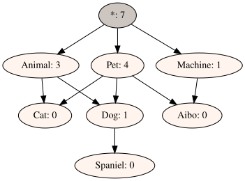

# OntoDAG User Guide

OntoDAG helps you organize things — files, notes, photos, products, ideas — into
**categories that can overlap**. You put items in, telling OntoDAG which categories
each one belongs to, and later you ask questions like *"show me everything that is
both an Animal and a Pet."*

This guide is for everyday users. It assumes you can open a terminal and copy-paste
commands, but not much more. Every example in it has been run for real — the outputs
you see are genuine. If you want to know how OntoDAG works internally,
read [`HOW_IT_WORKS.md`](HOW_IT_WORKS.md) afterwards.

---

## 1. Why OntoDAG? (one minute)

Computers usually offer two ways to organize things, and both are frustrating:

- **Folders** force every item into exactly one place. Where does a photo of your
  dog at a birthday party go — `Pets/` or `Parties/`? You must choose, and whichever
  you choose, you'll look in the other one first.
- **Tags** let an item carry many labels, but the labels themselves are a flat,
  unstructured heap. Tagging something `spaniel` doesn't make it show up when you
  search for `dog`, unless you remembered to add `dog` too. And `animal`. Every time.

OntoDAG sits exactly between the two:

- Like tags, an item can belong to **many categories at once**.
- Like folders, categories are **organized**: `Spaniel` can live under `Dog`, which
  lives under `Animal` and `Pet` — so anything filed as a `Spaniel` automatically
  counts as a `Dog`, an `Animal`, and a `Pet`, without you repeating yourself.

There is one more idea, and it's the whole query language: **asking = intersecting.**
You ask with a set of categories, and you get back everything that is under *all* of
them. `Animal` + `Pet` → your dog, your cat, but not your robot vacuum (a machine)
and not the fox from the garden (an animal, but no pet).

A note on vocabulary: in OntoDAG there is no difference between an "item" and a
"category." Everything is just a named thing that can sit under other named things
and can have things under it. Today's item is tomorrow's category — file a photo
under `Dog`, and later file crops of it under the photo. This is deliberate.

---

## 2. Installation

You need **Python 3.8 or newer** and `git`.

```bash
git clone https://github.com/petfold/ontodag.git
cd ontodag
pip install -e .
```

This installs the `odag` command and the Python library, along with its
dependencies (`graphviz`, `owlready2`, and `recordstore`).

Two optional extras:

- **Pictures.** To render your DAG as an image you also need the Graphviz *system
  program* (the Python package alone is not enough):

  ```bash
  sudo apt install graphviz        # Debian/Ubuntu
  brew install graphviz            # macOS
  ```

- **The web app.** For the browser interface and REST API:

  ```bash
  pip install -e ".[web]"
  ```

> **Running without installing:** if you just cloned the repo and don't want to
> install anything, prefix commands with `PYTHONPATH=src`, e.g.
> `PYTHONPATH=src python3 -m ontodag show`. Everything below works
> either way; we'll write `odag` for short, which is the same as
> `PYTHONPATH=src python3 -m ontodag`.

---

## 3. A five-minute tour (Python)

Start `python3` and type along. Everything is done with plain names:

```python
>>> from ontodag import OntoDAG

>>> dag = OntoDAG()

# Top-level categories: no parents.
>>> dag.put("Animal", [])
>>> dag.put("Machine", [])
>>> dag.put("Pet", [])

# Things under several categories at once — this is the point of OntoDAG.
>>> dag.put("Dog", ["Animal", "Pet"])
>>> dag.put("Cat", ["Animal", "Pet"])
>>> dag.put("Aibo", ["Machine", "Pet"])   # a robot pet
>>> dag.put("Spaniel", ["Dog"])
```

Here is the resulting graph, drawn by OntoDAG's own visualizer (§4.5). Arrows
point from general to specific; `*` is the built-in root above everything; the
number after each name is how many things sit below it:



Now ask questions. A query is a list of categories; the answer is everything under
**all** of them:

```python
>>> for item in dag.get(["Animal", "Pet"]):
...     print(item.name)
Cat
Spaniel
Dog

>>> for item in dag.get(["Machine", "Pet"]):
...     print(item.name)
Aibo
```

(Results are a set, so the order can vary.) Notice `Spaniel` appeared under
`Animal` + `Pet` even though you never said "Spaniel is an animal" or "Spaniel is
a pet" — it's under `Dog`, and that's enough. That's the inheritance doing your
bookkeeping for you.

Two more one-liners worth knowing:

```python
>>> dag.nodes["Pet"].descendant_count     # how many things are under Pet?
4
>>> dag.get(["Unicorn"])                  # unknown names are simply empty
set()
```

That's the core of OntoDAG. Everything else in this guide is ways to do the same
three things — **put, get, remove** — from files, from the command line, from a
browser, or over the network.

---

## 4. Everyday operations in Python

### 4.1 Adding items: `put`

```python
dag.put("Goldfish", ["Animal", "Pet"])
```

Rules of the road:

- **Parents must already exist.** `dag.put("X", ["Nope"])` raises
  `ValueError: One or more super-categories do not exist.` Add categories top-down.
- **No parents means top-level:** `dag.put("Vehicle", [])` files `Vehicle`
  directly under the root `*`.
- **Names are the identity.** Putting a name that already exists doesn't create a
  duplicate — it adds the new parent links to the existing item.
- **Redundant links are cleaned up automatically.** Say you add
  `dag.put("Spaniel", ["Animal", "Dog"])`. The `Animal` link is
  redundant — Spaniel is already an Animal *via* Dog — so OntoDAG silently skips it:

  ```python
  >>> sorted(p.name for p in dag.nodes["Spaniel"].parents)
  ['Dog']
  ```

  You can never make the graph messy this way; it tidies itself. (Why it insists on
  this is explained in [`HOW_IT_WORKS.md`](HOW_IT_WORKS.md) — it's the property the
  whole design rests on.)
- **Cycles are refused.** Categories can't be their own ancestors:

  ```python
  >>> dag.put("Animal", ["Spaniel"])
  ValueError: Edge Spaniel -> Animal would create a cycle.
  ```

(For the record: everywhere this guide passes a name string, an `Item` object —
`from ontodag import Item` — is accepted too; `dag.put(Item("Dog"), ...)` and
`dag.put("Dog", ...)` mean exactly the same thing. Strings are just easier.)

**The `optimized=True` flag.** Sometimes you know some general categories for an
item, and more specific ones already exist that follow from them. With
`optimized=True`, `put` files the item under the *most specific* categories your
list implies, instead of the ones you typed. Example: suppose categories `AB`
(under A and B), `BC` (under B and C), `ABC` (under AB and BC) and `CD` (under C
and D) exist, and you add:

```python
dag.put("E", ["AB", "CD"], optimized=True)
```

E ends up under `ABC` and `CD` — because anything under both `AB` and `CD` is
under A, B, C and D, and `ABC` is a more precise home that already captures three
of those. If that sounds like more thinking than you want to do: that's exactly why
the flag does it for you. When in doubt, leave it off; the default is predictable.

### 4.2 Asking questions: `get`

```python
results = dag.get(["Animal", "Pet"])
for item in results:
    print(item.name)
```

- One or more category names; the answer is everything under **all** of them,
  returned as a set of item objects — each has a `.name` and a
  `.descendant_count`.
- The categories themselves are not in the answer (asking for `Animal` + `Pet`
  returns Dog, not Pet).
- Unknown category → empty set, no error.
- An empty list raises `TypeError` — a query has to ask *something*.
- Order doesn't matter, and redundant terms are ignored: asking for
  `[Animal, Dog]` is the same as asking for `[Dog]`, since everything under Dog is
  already under Animal. You can be sloppy; the query planner sorts it out (and
  picks an efficient evaluation order for you — details in the internals doc).

### 4.3 Removing: `remove`

```python
dag.remove("Dog")
```

What happens to Dog's children? They are **reconnected to Dog's parents**, so
nothing becomes orphaned and no query answer changes except those that mentioned
Dog itself:

```python
>>> dag.put("Puppy", ["Dog"])
>>> dag.remove("Dog")
>>> sorted(p.name for p in dag.nodes["Puppy"].parents)
['Animal', 'Pet']
```

Puppy silently moved up to where Dog used to hang.

### 4.4 Combining two DAGs: `merge`

```python
mine.merge(theirs)      # everything in `theirs` is now also in `mine`
```

Merging unions the two graphs: all names from both, all category relationships from
both, redundant links pruned as usual. Items with the same name are treated as the
same item (names are the identity — so agree on names before you merge!).

Merge is designed so that **order never matters**: if you merge my DAG into yours
and I merge yours into mine, we end up with identical graphs. This is what will
eventually let several people maintain one shared ontology without a central
server. (See "future plans" in the internals doc.)

### 4.5 Pictures

```python
from ontodag import OntoDAGVisualizer

viz = OntoDAGVisualizer(format="png")        # also: "svg", "pdf"
viz.visualize(dag, filename="petshop")       # writes petshop.png
```

Requires the Graphviz system program (see Installation). The root is drawn shaded;
arrows point from general to specific.

### 4.6 Saving and loading files

OntoDAG reads and writes standard **OWL ontology** files, in two flavors:

```python
from ontodag import OWLOntology

# Human-friendly text format (Manchester syntax) — recommended:
OWLOntology.export_dag_manchester(dag, "petshop.omn")
dag2 = OWLOntology.import_dag_manchester(file_name="petshop.omn")

# RDF/XML (.owl), for interoperability with other ontology tools:
OWLOntology.export_dag(dag, "petshop.owl")
```

`.omn` files are ordinary text you can read and even write by hand — see §7. Both
formats open in standard ontology editors like Protégé.

---

## 5. The command line

Everything in §4 can be done without writing any Python. The command is `odag`, and
it behaves like an ordinary Unix tool: **it works on a persistent store, prints
nothing on success, sends errors to stderr, and pipes cleanly**. If you installed
with pip you have the `odag` command; otherwise use `PYTHONPATH=src python3 -m
ontodag` from the repository root.

```
odag <command> ...

  put SUB [PARENT...]   add SUB under the PARENT categories (or the root)
  get CAT [CAT...]      print items below all of the CATs, one per line
  remove ITEM           remove ITEM from the store
  show                  print the DAG structure
  list                  print every item name
  merge FILE            merge FILE into the store
  import FILE           replace the store with the contents of FILE
  export FILE           write the store to FILE
  visualize [--out B]   render the DAG to an image
  set [store PATH]      show config, or set the default store
  help                  show this help
```

Run `odag <command> --help` for the options of each.

### 5.1 The store

There is no file to create first. `odag` keeps a default store in a hidden directory
in your home — `~/.ontodag/store.od` — and every command reads and writes it. So
you can start adding things immediately, and `odag put cat` / `odag get cat` just work.

The store is a canonical, line-oriented text file (one item per line, `name
parent1 parent2 …`), so it diffs and merges cleanly in git. Point at a different
store for one command with `-f PATH`, or change the default permanently with
`set store PATH`:

```console
$ odag set store ~/work/pets.od      # writes ~/.ontodag/config; silent
$ odag set                           # show every setting
store = /home/you/work/pets.od
bee_api = http://localhost:1633
bee_batch =
$ odag set store                     # show just one (no value = display, never an error)
store = /home/you/work/pets.od
```

`set KEY VALUE` changes a setting; `set KEY` on its own displays it; `set`
alone lists them all. The settings are `store` and — for the Swarm backend
below — `bee_api` / `bee_batch`.

Files ending in `.owl` or `.omn` are read and written as OWL / Manchester syntax
instead of the native format — so `odag -f pets.omn get Animal` works directly on an
ontology file, and `export`/`import` convert between them.

**Storing on Swarm.** A store can also live on [Ethereum Swarm](https://www.ethswarm.org/)
instead of a local file. It needs one extra dependency — install it once with
`pip install -e ".[swarm]"` (this pulls in `requests`; without it you get a
clear message telling you so). Then set the store once and it sticks:

```console
$ odag set store swarm:pets       # every later command now uses Swarm
$ odag put Animal
$ odag get Animal
```

The DAG's content is written to a Bee node (content-addressed, immutable), while
the pointer to the *latest* version is kept locally at `~/.ontodag/pets.root` — so
no signing key is needed to get started. Point `odag` at your node with the `BEE_API`
and `BEE_BATCH` environment variables, or `bee_api` / `bee_batch` lines in
`~/.ontodag/config`; writes need a funded [postage batch](https://docs.ethswarm.org/docs/develop/access-the-swarm/buy-a-stamp-batch).
Reading and writing an empty store needs no node, but `put`/`import` (which commit
to Swarm) do — without one you get a clear `Connection refused` error, and nothing
is lost. Switch back to a file any time with `odag set store PATH`.

### 5.2 A complete worked session

Build the pet shop from nothing — each `put` is silent on success:

```console
$ odag put Animal
$ odag put Machine
$ odag put Pet
$ odag put Dog Animal Pet
$ odag put Cat Animal Pet
$ odag put Aibo Machine Pet
```

Look at what you have:

```console
$ odag show
* [root] -> Animal Machine Pet
Pet (*) -> Aibo Cat Dog
Machine (*) -> Aibo
Aibo (Machine Pet) ->
Animal (*) -> Cat Dog
Cat (Animal Pet) ->
Dog (Animal Pet) ->
```

Ask which things are both animals and pets — one name per line, straight to stdout:

```console
$ odag get Animal Pet
Cat
Dog
```

Add a spaniel under Dog; nobody typed "Spaniel is an Animal" — being under Dog was
enough:

```console
$ odag put Spaniel Dog
$ odag get Animal
Cat
Dog
Spaniel
```

Remove an item (children reconnect to its parents automatically), and list every
name:

```console
$ odag remove Cat
$ odag list
Aibo
Animal
Dog
Machine
Pet
Spaniel
```

Because output is plain lines, it pipes:

```console
$ odag get Animal | wc -l
2
$ odag get Animal | grep Span
Spaniel
```

### 5.3 Pipes, scripts and interactive mode

Run with no command and `odag` reads commands from standard input — one per line,
`#` comments allowed — which makes stores scriptable:

```console
$ printf 'put Drone Machine\nget Machine\n' | odag
Aibo
Drone
```

Run it with no command on a terminal and you get an interactive prompt instead:

```console
$ odag
Ontodag 0.1.0 - type help for help
> put Fish Pet
> get Pet
Aibo
Dog
Fish
Spaniel
> quit
```

### 5.4 Converting, merging and drawing

`export` writes the current store to a file; the format follows the extension.
`import` replaces the store from a file; `merge` folds another file in (shared
category names knit the two together). All three are silent on success:

```console
$ odag export pets.owl              # native store -> OWL
$ odag export pets.omn              # -> Manchester syntax
$ odag merge gadgets.omn            # fold gadgets.omn into the store
$ odag visualize --format svg --out pets
```

`visualize` accepts `--format png|svg|pdf` and `--out NAME` for the output name.
`put` accepts `--optimized` (see §4.1). `get`, `show` and `list` accept `-o FILE`
to write to a file instead of stdout.

Useful habits:

- The native store is line-oriented text; keep `~/.ontodag` (or a `-f` store) in a
  git repository and diffs stay readable, merges reviewable.
- Item names with parents are positional: `odag put ITEM PARENT1 PARENT2 …`. Omit the
  parents to add a top-level category.
- If a parent doesn't exist yet, the command changes nothing and reports on stderr
  with a non-zero exit code: `odag: One or more super-categories do not exist.`

---

## 6. The web app and REST API

The web app gives you the same DAG in a browser — with live pictures — plus an HTTP
API you can script against.

```bash
cd web
python3 app.py          # starts http://localhost:5000  (needs the [web] extra)
```

Open **http://localhost:5000** for the interactive UI: add items, run queries,
watch the graph redraw, import and export files. There is also a self-contained
demo of a used-car marketplace built on OntoDAG at **http://localhost:5000/market**
— categories like fuel type, body style and price band form the DAG, and buyer
searches are DAG queries.

### 6.1 Scripting it with curl

Each browser session gets its own private DAG (a session cookie keeps them apart),
so tell curl to remember cookies with `-c`/`-b`:

```console
$ curl -s -c cookies.txt -X POST http://localhost:5000/dag
{
  "message": "New OntoDAG created."
}

$ curl -s -b cookies.txt -X POST http://localhost:5000/dag/node \
    -H "Content-Type: application/json" \
    -d '{"subcategories": ["Animal", "Pet", "Machine"]}'
{
  "message": "Item(s) inserted."
}

$ curl -s -b cookies.txt -X POST http://localhost:5000/dag/node \
    -H "Content-Type: application/json" \
    -d '{"subcategories": ["Dog", "Cat"], "super_categories": ["Animal", "Pet"]}'
{
  "message": "Item(s) inserted."
}
```

(`super_categories` omitted = top-level. Several `subcategories` at once is fine.)

Query — categories comma-separated in the `cat` parameter:

```console
$ curl -s -b cookies.txt "http://localhost:5000/dag/query?cat=Animal,Pet"
{
  "nodes": [
    {
      "descendant_count": 0,
      "name": "Dog",
      "neighbors": []
    },
    {
      "descendant_count": 0,
      "name": "Cat",
      "neighbors": []
    }
  ]
}
```

Remove items:

```console
$ curl -s -b cookies.txt -X DELETE http://localhost:5000/dag/node \
    -H "Content-Type: application/json" -d '{"subcategories": ["Cat"]}'
{
  "message": "Item(s) removed."
}
```

Export your session's DAG (Manchester text arrives on stdout; also `/dag/export`
for .owl, `/dag/export/dot` and `/dag/export/tex` for Graphviz/LaTeX sources):

```console
$ curl -s -b cookies.txt http://localhost:5000/dag/export/omn
Prefix: : <urn:ontodag_…#>
…
Class: :Aibo
    SubClassOf: :Machine, :Pet
…
```

Import a file into the session (it merges into whatever is already there):

```console
$ curl -s -b cookies.txt -X POST http://localhost:5000/dag/import \
    -F "file=@petshop.omn"
{
  "message": "File imported and DAG created."
}
```

Pictures over HTTP — the whole DAG or a query result:

```console
$ curl -s -b cookies.txt http://localhost:5000/dag/image -o dag.png
$ curl -s -b cookies.txt "http://localhost:5000/dag/query/image?cat=Animal,Pet" -o result.png
```

> **Gotcha:** the image endpoints need the session's visualizer, which is set up
> when a browser page first loads. If you use *only* curl, hit the front page once
> first: `curl -s -b cookies.txt -c cookies.txt http://localhost:5000/ -o /dev/null`.

Endpoint summary:

| Method & path                | What it does                                   |
|------------------------------|------------------------------------------------|
| `POST /dag`                  | Start a fresh, empty DAG in your session       |
| `GET /dag`                   | The whole DAG as JSON                          |
| `POST /dag/node`             | Add item(s): `{"subcategories": [...], "super_categories": [...]}` |
| `DELETE /dag/node`           | Remove item(s): `{"subcategories": [...]}`     |
| `GET /dag/query?cat=A,B`     | Everything under all the listed categories     |
| `GET /dag/image`             | PNG of the DAG                                 |
| `GET /dag/query/image?cat=…` | PNG of a query and its results                 |
| `POST /dag/import`           | Merge an uploaded `.owl`/`.omn` file into the session |
| `GET /dag/export`            | Download as `.owl` (RDF/XML)                   |
| `GET /dag/export/omn`        | Download as Manchester syntax                  |
| `GET /dag/export/dot`, `/dag/export/tex` | Graphviz DOT / LaTeX source        |

The same `export`/`import` endpoints exist under `/dag/query/…` operating on the
result of your last query instead of the whole DAG.

> The dev server is for local, personal use. Don't expose it to the internet as-is.

---

## 7. The file format, briefly

A `.omn` (Manchester syntax) file is just the DAG written as OWL classes:

```
Class: :Dog
    SubClassOf: :Animal, :Pet
```

reads as "Dog is a subclass of Animal and of Pet" — exactly OntoDAG's
`put(Dog, [Animal, Pet])`. When OntoDAG writes the file itself you'll also see a
class named `*` (the root) and `Prefix:`/`Ontology:` header lines; when writing by
hand you can skip the root — top-level classes are attached to it automatically.

Because these are standard OWL constructs, your files open in ontology tools such
as **Protégé**, and conversely, the class hierarchy of an existing OWL ontology can
be imported into OntoDAG (`odag -f yourfile.owl show` — OntoDAG reads the
subclass-of skeleton and ignores everything else).

---

## 8. Experimental: saving your DAG to Swarm

OntoDAG can persist itself through a **content-addressed record store** — the
storage model used by [Ethereum Swarm](https://www.ethswarm.org/), a decentralized
network where data is retrieved by the fingerprint of its content. Support ships
today as `SwarmOntoDAG`; here it is over an in-memory store (no network needed):

```python
from ontodag import SwarmOntoDAG
from recordstore import RecordStore, MemoryBytesStore

store = RecordStore(MemoryBytesStore())
dag = SwarmOntoDAG(store)

dag.put("Animal", [])
dag.put("Dog", ["Animal"],
        payload="swarm-ref-of-a-photo",          # optional: content this item tags
        meta={"content-type": "image/jpeg"})     # optional: free-form metadata

root = dag.commit()      # every commit returns a fingerprint of the whole DAG
```

That `root` string *is* your ontology-at-this-moment: anyone holding it (and the
store) can reconstruct exactly this DAG, and the same DAG always produces the same
root, no matter in what order it was built. Re-committing without changes returns
the identical root. A `SwarmOntoDAG` constructed over a store with existing data
loads it automatically and behaves like any other OntoDAG.

To store on the real Swarm network instead of memory, use `BeeBytesStore` from
`recordstore`, pointed at a running Bee node with a purchased postage batch. That
setup (nodes, stamps, costs) is beyond this guide — see `docs/SWARM_DESIGN.md` for
the design and current status, and the recordstore project for store options.

Once a store lives on Swarm, it can also be **browsed as a filesystem** with
[ontodag-fs](https://github.com/petfold/ontodag-fs): directory paths are
category queries (`/pet/dog` = everything that is a pet AND a dog), files are
classified objects, and the whole thing FUSE-mounts. Its `odag-fs` command
shares odag's store settings, so `odag set store swarm:pets` configures both.

---

## 9. Rules OntoDAG enforces (and why you'll be glad)

These behaviors are guarantees, not accidents. You can rely on them:

1. **No cycles, ever.** An attempt to make a category its own ancestor is refused
   with a clear error, and the graph is untouched.
2. **No redundant links, ever.** If a relationship is already implied (Spaniel →
   Animal when Spaniel → Dog → Animal exists), it is not stored; if adding a link
   makes an old one redundant, the old one is dropped. Your graph is always the
   minimal, tidy version of itself.
3. **Order never matters.** Add parents in any order, merge in any order, build the
   same content by any history — you get the identical graph.
4. **Names are the identity.** The name string *is* the item: `"Dog"` here and
   `Item("Dog")` there refer to the same thing, in one DAG or across DAGs. There
   are no duplicate names and no hidden IDs.
5. **Counts are always right.** `descendant_count` is kept exactly consistent with
   the graph after every operation.
6. **Removal never orphans.** Children of a removed item reattach to its parents.

(Each of these is enforced by a dedicated test suite — see the internals doc.)

---

## 10. Troubleshooting

**`ModuleNotFoundError: No module named 'ontodag'`**
You're running from the repo without installing. Either `pip install -e .` or
prefix with `PYTHONPATH=src` (from the repository root).

**`ModuleNotFoundError: No module named 'owlready2'` (or `graphviz`, `flask`)**
A dependency is missing — `pip install -e .` for the basics,
`pip install -e ".[web]"` for the web app.

**`graphviz.backend.execute.ExecutableNotFound: failed to execute 'dot'`**
The Graphviz *system program* isn't installed (the Python package is just a
wrapper). `sudo apt install graphviz` / `brew install graphviz`.

**Image endpoints return an error page (KeyError: 'visualizer')**
Load `http://localhost:5000/` once in that session first — see the gotcha in §6.1.

**`ValueError: One or more super-categories do not exist.`**
Parents must be added before children. Check spelling — names are case-sensitive.

**A query returns nothing, but I'm sure there are results**
Check the names (case matters: `pet` ≠ `Pet`). An unknown category makes the whole
answer empty, because nothing can be under a category that doesn't exist.

**`TypeError: get() requires at least one super-category`**
You passed an empty query. Ask for at least one category.

**My web DAG disappeared**
Each browser session has its own DAG, held in memory. Restarting the server or
losing the session cookie starts you fresh. Export to a file (`/dag/export/omn`)
when you want to keep something.
